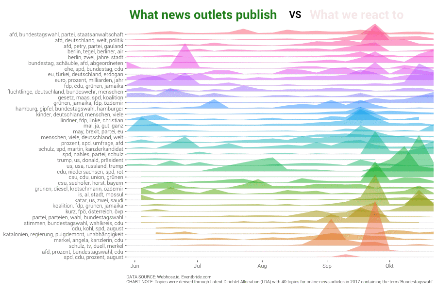

```{r}
suppressPackageStartupMessages({
  library(dplyr)       # Data manipulation
  library(stringr)     # String manipulation
  library(lubridate)   # Date and time manipulation
  library(purrr)       # Functional programming
  library(tidyr)       # Reshaping
  library(magrittr)    # Advanced piping
  library(pushoverr)   # Pushover notifications
  library(doMC)        # Parallel Computing
  library(readr)       # Importing data
  library(tibble)      # Better data frames
  library(data.table)
  
  library(ggplot2)     # Static data visualization
  library(ggrepel)     # Repel text labels
  library(ggiraph)     # GGplot interactive
  library(scales)      # Scales
  library(viridis)     # Viridis color scales
  library(htmlwidgets) # JS visuliaztions
  library(htmltools)   # Arbitrary html
  library(ggjoy)       # Create joyplots
  library(gganimate)   # Animating ggplots
  library(tweenr)      # Tweening charts
  library(igraph)
  
  library(httr)        # HTTP functions
  library(jsonlite)    # JSON parsing
  
  library(tidytext)    # Tidy text mining
  library(tm)    # Tidy text mining
  library(hunspell)    # Text processing
  library(stringdist)  # String distances
  library(topicmodels) # Topic modelling
  library(stm)         # Sructural Topic Model
  library(proxy)       # Distance measures
  library(SnowballC)   # Stemming
})

# Theming
quartzFonts(
  Roboto =
    c("Roboto-Light",
      "Roboto-Bold",
      "Roboto-Regular",
      "Roboto-Thin")
)

theme_set(
  theme_bw(base_family = "Roboto", base_size = 14) +
    theme(
      plot.title = element_text(face = "bold", size = 14,
                                margin = margin(0, 0, 4, 0, "pt")),
      plot.subtitle = element_text(size = 12),
      plot.caption = element_text(size = 6, hjust = 0),
      axis.title = element_text(size = 10),
      panel.border = element_blank()
    )
)

rm(list=ls())
# Functions
source("func/topic-modelling-functions.R")
```

```{r caching, echo=, message=FALSE, warning=FALSE}
load("../output/btw_combined.Rda")
#load("../output/models/STM 25 .Rda")
```

### Tokenizing
```{r Tokenize}
btw %>% 
  unnest_tokens(word, text_cleaned, token = "words") %>%
  filter(str_length(word) >= 3) ->
  posts_tokenized.dt

# Summarise
posts_tokenized.dt %>% 
  group_by(articleID, word) %>%
  dplyr::summarise(term_frequency = n()) %>%
  ungroup() ->
  posts_tokenized.dt
```

# Structural Topic Model

## Preparation
```{r}
btw %>% mutate(week = week(date)) -> btw
```

### Build Corpus
```{r eval=FALSE, include=FALSE}
# Process data
processed <- textProcessor(btw$text_cleaned, metadata = btw[,c("site","text_cleaned","month")],
                           wordLengths = c(2,Inf),
                           lowercase = F,
                           removestopwords = F,
                           removenumbers = F,
                           removepunctuation = F,
                           stem = F)
out <- prepDocuments(processed$documents, processed$vocab, processed$meta)
```

### Select number of topics
```{r}
K<-c(30,40,50,60)

t1 <- Sys.time()
kresult <- searchK(out$documents, 
                   out$vocab, 
                   K, 
                   prevalence=~site + s(month), 
                   data = out$meta,
                   max.em.its = 75,
                   seed =8458159,
                   init.type = "Spectral")
t2 <- Sys.time()
t2 - t1

save(btw, out, kresult, file="../output/models/kresult.Rda")
load(file="../output/models/kresult.Rda")
```

```{r}
plot(kresult)
```

## Run the Model
We then train the Structural Topic Model on the full dataset, with $k = 28$.

```{r}
k = 15 # Topics

t1 <- Sys.time()
stmOut <- stm(documents = out$documents,
           vocab = out$vocab,
           K=k,
           prevalence = ~site+s(month),
           data=out$meta,
           #max.em.its = 150,
           seed =8458159,
           init.type = "Spectral")
t2 <- Sys.time()
t2 - t1

save(stmOut, btw, out, file=paste("../output/models/STM",k,".Rda"))
#load(file=paste("../output/models/STM",k,".Rda"))
```

## Explore Model Results

#### Extract posterior distributions
```{r Extract wtp and dtp}
# Word-topic probabilities
stmOut %>% tidy("beta") %>% filter(!is.na(topic)) -> posts.wtp

# Document-topic probabilities
stmOut %>% tidy("gamma") -> posts.dtp
```

#### Compute different word-relevance measures
```{r Compute relevance}
posts.wtp %>%
    filter(str_length(term) >= 3) %>%
  # Compute lambda and phi_kw
  mutate(lambda = 0.6, phi_kw = beta) %>% 
  # Compute and join the p_w
  left_join(
    posts_tokenized.dt %>%
      group_by(word) %>% 
      dplyr::summarise(frequency = sum(term_frequency)) %>% 
      ungroup() %>% 
      mutate(p_w = frequency/sum(frequency)) %>% 
      select(-frequency),
    by = c("term" = "word")
  ) %>%
  # Compute the relevance
  mutate(relevance = lambda * log(phi_kw) + (1 - lambda) * log(phi_kw/p_w)) ->
  word_relevance.dt
```

#### Topic Labeling
```{r Label Topics}
label <- labelTopics(stmOut, n=4)

prob <- as.data.frame(label$prob, stringsAsFactors = F)
frex <- as.data.frame(label$frex, stringsAsFactors = F)
lift <- as.data.frame(label$lift, stringsAsFactors = F)
score <- as.data.frame(label$score, stringsAsFactors = F)

topicLabel <- prob %>% 
  transmute(topic = rownames(.),
            topic_name = paste(prob$V1,prob$V2,prob$V3,score$V1,score$V2,score$V3, sep=","),
            prob = paste(prob$V1,prob$V2,prob$V3, sep=","),
            frex = paste(frex$V1,frex$V2,frex$V3, sep=","),
            lift = paste(lift$V1,lift$V2,lift$V3, sep=","),
            score = paste(score$V1,score$V2,score$V3, sep=",")) 

topicLabel$topic_name <- vapply(lapply(strsplit(topicLabel$topic_name, ","), unique), paste, character(1L), collapse = " ")
rm(prob, frex, lift, score)
```

```{r Add Topic to original DF}
# Create Dataframe
theta <- as.data.frame(stmOut$theta)
names(theta) <- as.character(1:25)
theta$topic <- colnames(theta)[apply(theta,1,which.max)]

doctopics.df <- theta %>%
  transmute(articleID = as.numeric(rownames(.)),
    topic = topic)

# Add Topic to origian DF
btw %>%
  inner_join(.,doctopics.df %>%
               mutate(topic=as.numeric(topic)), by="articleID") %>%
  ## Combine with Topic label
  left_join(., topicLabel %>%
              mutate(topic = as.numeric(topic)) %>%
              select(topic_name, topic) %>%
              mutate(topic = as.numeric(topic)), by="topic") -> btw

# subset  
topics_mapping.dt <- btw %>%
  group_by(topic) %>%
  slice(5) %>%
  select(topic, articleID, topic_name)
```

### Sample articles

Now that we have labelled each topic, we produce sample documents classified to that topic for reference. We produce a random sample of 10 posts from the 300 highest probability fits per topic.

```{r Document classification}

set.seed(9272)

posts_classification.sdt <-
  posts.dtp %>% 
  group_by(articleID = document) %>% 
  summarise(topic = min(topic[gamma == max(gamma)]), gamma = max(gamma)) %>% 
  ungroup() %>%
  inner_join(btw %>% select(title, title_text, articleID, topic_name),
              by = "articleID") %>%
  #inner_join(topics_mapping.dt, by = "topic") %>%
  mutate(topic_title = 
           paste0("Topic ", formatC(topic, flag = "0", width = 2), 
                  " - ", topic_name)) %>%
  group_by(topic_name) %>% 
  top_n(300, gamma) %>%
  sample_n(10) %>% 
  mutate(row = row_number()) %>% 
  ungroup() 

```

We produce a chart that shows this in a presentable manner.

```{r Document classification chart, echo=TRUE}

ggsave(
  plot = {
    posts_classification.sdt %>% 
      ggplot(aes(x = 0, y = row, color = factor(topic, levels = 1:25))) +
      facet_wrap(~topic_title, ncol = 5) +
      geom_text(
        aes(label = title),
        size = 2, hjust = 0, family = "Roboto"
      ) +
      geom_point(aes(x = -0.025), size = 0.5) +
      scale_x_continuous(limits = c(-0.05, 1), expand = c(0, 0)) +
      scale_color_manual(
        values = rainbow(25) %>% 
          adjustcolor(red.f = 0.6, green.f = 0.6, blue.f = 0.6)
      ) +
      theme(
        axis.title       = element_blank(),
        axis.text        = element_blank(),
        axis.ticks       = element_blank(),
        panel.grid       = element_blank(),
        strip.background = element_blank(),
        panel.border     = element_blank(),
        strip.text       = element_text(face = "bold", hjust = 0, size = 6),
        plot.background  = element_rect(fill = "#FAFAFA"),
        legend.position  = "none"
      ) 
  },
  device = "png",
  filename = "../figs/topic-classification-sample.png",
  dpi = 600, height = 10, width = 16
)

```


### News landscape 

After performing the topic modeling, we can generate an overview of the news landscape about the german elections. Each group is composed of the most relevant words for that topic, and a manually-determined label. The distances that the topics have from each other reflect their semantic distance, or basically how different the words are for that topic. It is computed as the Jensen-Shannon divergence between each of the topics according to the differences in their word-topic probabilities. We then apply principal coordinates analysis in order to project the distance matrix down to two dimensions.

```{r echo=TRUE}
posts.wtp %>% 
  # Compute Jensen-Shannon
  computeJensenShannonPCA() %>% {
    
    # Assign positions to top 30 most relevant words
    left_join(
      .,
      word_relevance.dt %>% 
        group_by(topic) %>% 
        top_n(30, relevance) %>% 
        ungroup(),
      by = "topic"
    ) -> topic_labelling_top30words.dt
    
    # Assign positions to topic labels
    left_join(
      .,
      topics_mapping.dt,
      by = "topic"
    ) -> topic_labelling_topics.dt
    
    ggsave(
      plot = {
        topic_labelling_top30words.dt %>% 
          ggplot(aes(x = x, y = y)) +
          geom_text_repel(
            aes(label = term, 
                color = factor(topic, levels = 1:25), 
                size = phi_kw * p_w), 
            lineheight = 0.6, 
            segment.size = NA,
            box.padding = unit(0, "lines"),
            force = 0.05,
            family = "Roboto"
          ) +
          geom_text_repel(
            data = topic_labelling_topics.dt,
            aes(label = str_wrap(topic_name, 15),
                color = factor(topic, levels = 1:25)),
            size = 2.25, lineheight = 0.7,
            segment.size = 0.5, alpha = 0.7,
            family = "Roboto", fontface = 2,
            force = 0.3
          ) +
          scale_size_continuous(range = c(1, 4)) +
          scale_color_manual(
            values = rainbow(25) %>% 
              adjustcolor(red.f = 0.6, green.f = 0.6, blue.f = 0.6)
          ) +
          theme(
            axis.title = element_blank(),
            axis.text  = element_blank(),
            axis.ticks = element_blank(),
            panel.grid = element_blank(),
            panel.border = element_blank(),
            plot.background = element_rect(fill = "#FAFAFA"),
            legend.position = "none"
          ) +
          labs(
            title    = ""
          )
      },
      filename = "../figs/news-landscape-map.png",
      device = "png",
      dpi = 600
    )
    
  }

```


### Topic Trends

We classify each document based on which topic has the highest probability. If one or more topics have equal probability, then the count is assigned equally to all the topics.

```{r Topic classification}
posts.dtp %>% 
  group_by(document) %>% 
  filter(gamma == max(gamma)) %>%
  mutate(allocation = 1/n()) %>% 
  ungroup() ->
  posts_classification.dt

```

We construct a chart that allows us to explore topic trends, both in terms of document count and the total number of reactions on the articles of that particular topic.

```{r Data for topic trends chart}

set.seed(7292)
posts_classification.dt %>% 
  # Add post information
  inner_join(
    btw %>% 
      mutate(document = as.numeric(articleID),
             date = as.POSIXct(date)) %>%
      select(document, date, 
             title) %>% 
      mutate(post_period = 
               date %>% 
               with_tz("Europe/Paris") %>% 
               floor_date("week")),
    by = "document"
  ) %>% 
  # Add topic information
  left_join(topics_mapping.dt, by = "topic") %>%
  # Summarise into tidy dataframe
  group_by(post_period, topic_name) %>% 
  summarise(
    articles = sum(allocation),
    sample_articles = 
      paste0("<li>", sample(title, 4, replace = TRUE ), "</li>", collapse = "<br>")
  ) %>%
  ungroup() %>% 
  mutate(
    tooltip_text = 
      paste0(
        "<b>", topic_name, "</b> in period of <b>", post_period, "</b><br>",
        "<b>Number of Articles:</b> ", comma(round(articles, 0)), "<br>",
        "<b>Sample Articles:</b><br><ul>", sample_articles, "</ul>"
      )
  ) %>% 
  # Mark peaks 
  group_by(topic_name) %>% 
  mutate_at(
    vars(articles), 
    funs(mean = mean(.), sd = sd(.), zscore = (. - mean(.))/sd(.))
  ) %>% 
  ungroup() %>% 
  mutate_at(
    vars(ends_with("zscore")),
    funs(peak = . >	1.96)
  ) %>% 
  mutate(tooltip_text = str_replace_all(tooltip_text, "'", "")) ->
  chart_topic_trends.dt
```

```{r message=FALSE, warning=FALSE}
chart_topic_trends.dt %>% 
    ggplot(
      aes(
        x = post_period, 
        y = factor(
          topic_name, 
          chart_topic_trends.dt %>% 
            group_by(topic_name) %>% 
            summarise(post_period = mean(post_period[peak], na.rm = TRUE)) %>% 
            ungroup() %>% 
            arrange(desc(post_period)) %$%
            unique(topic_name)
        )
      )
    ) +
    geom_tile_interactive(aes(tooltip = tooltip_text, fill = log(articles))) +
    geom_point_interactive(
      mapping = aes(tooltip = tooltip_text),
      data = chart_topic_trends.dt %>% filter(peak),
      color = "red"
    ) +
    scale_fill_viridis(
      labels = function(x) comma(round(exp(x))), 
      name = "Number of Articles",
      option = "plasma"
    ) +
    scale_x_datetime(expand = c(0, 0)) +
    labs(
      title = "", 
      caption = "
  Red dots indicate weeks where the number of articles exceeds 1.96 SD above mean for that topic
      " ) +
    theme(
      legend.position   = "bottom",
      legend.key.width  = unit(0.05, "npc"),
      legend.background = element_rect("#fafafa"),
      plot.background   = element_rect("#fafafa", "#fafafa"),
      plot.title        = element_text(size = 18),
      plot.subtitle     = element_text(size = 8),
      plot.caption      = element_text(size = 7),
      panel.grid        = element_blank(),
      panel.background  = element_rect("#fafafa"),
      axis.title        = element_blank(),
      axis.ticks        = element_blank(),
      axis.text.y       = element_text(size = 8)
    ) 

ggsave("../figs/topic-trends.png")
```

## Animated Figures

```{r Topic trends chart, eval = TRUE}

{
  chart_topic_trends.dt %>% 
    ggplot(
      aes(
        x = post_period, 
        y = factor(
          topic_name, 
          chart_topic_trends.dt %>% 
            group_by(topic_name) %>% 
            summarise(post_period = mean(post_period[peak], na.rm = TRUE)) %>% 
            ungroup() %>% 
            arrange(desc(post_period)) %$%
            unique(topic_name)
        )
      )
    ) +
    geom_tile_interactive(aes(tooltip = tooltip_text, fill = log(articles))) +
    geom_point_interactive(
      mapping = aes(tooltip = tooltip_text),
      data = chart_topic_trends.dt %>% filter(peak),
      color = "red"
    ) +
    scale_fill_viridis(
      labels = function(x) comma(round(exp(x))), 
      name = "Number of Articles",
      option = "plasma"
    ) +
    scale_x_datetime(expand = c(0, 0)) +
    labs(
      title = ""
    ) +
    theme(
      legend.position   = "bottom",
      legend.key.width  = unit(0.1, "npc"),
      legend.background = element_rect("#fafafa"),
      plot.background   = element_rect("#fafafa", "#fafafa"),
      plot.title        = element_text(size = 18),
      plot.subtitle     = element_text(size = 8),
      plot.caption      = element_text(size = 7),
      panel.grid        = element_blank(),
      panel.background  = element_rect("#fafafa"),
      axis.title        = element_blank(),
      axis.ticks        = element_blank(),
      axis.text.y       = element_text(size = 8)
    ) 
} %>% 
  ggiraph(
    ggobj = .,
    # width_svg  = 8,
    # height_svg = 7,
    width = 1,
    tooltip_extra_css = "
    font-family: Roboto; 
    background-color: #000; 
    color: #fff; font-size: 10px;
    padding: 5px;"
  ) %>% 
  prependContent(
    tags$link(
      href = "https://fonts.googleapis.com/css?family=Roboto:400,700", 
      rel = "stylesheet"
    )
  ) -> chart_topic_trends.wdgt

saveWidget(
  widget = chart_topic_trends.wdgt,
  file = "../figs/topic-trends.html",
  selfcontained = FALSE,
  libdir = "../figs/js",
  background = "#fafafa"
)

chart_topic_trends.wdgt

```

```{r Topic trends line chart, eval = TRUE}

{ 
  chart_topic_trends.dt %>%
  select(post_period, topic_name, articles) %>% 
  mutate(data_id = row_number() %>% as.character()) %>% 
  ggplot(aes(x = post_period, y = articles)) +
  geom_path_interactive(
    aes(group = topic_name, 
        tooltip = str_replace_all(topic_name, "'", ""),
        data_id = data_id), 
    color = "grey51"
  ) +
    scale_y_continuous(labels = comma) +
    labs(
      title = "PEAKS AND TROUGHS",
      subtitle = "Hover over each line to see the trend of news articles for a particular topic",
      y = "Number of Articles"
    ) +
    theme(
      plot.background   = element_rect("#fafafa", "#fafafa"),
      plot.title        = element_text(size = 18),
      plot.subtitle     = element_text(size = 8),
      plot.caption      = element_text(size = 7),
      panel.grid        = element_blank(),
      panel.background  = element_rect("#fafafa"),
      axis.title.x      = element_blank(),
      axis.text.y       = element_text(size = 8)
    )
} %>% 
  ggiraph(
    ggobj = .,
    hover_css = "stroke: hotpink; stroke-width: 3px;",
    width = 1,
    width_svg = 8,
    height_svg = 4,
    tooltip_extra_css = "
    font-family: Roboto; 
    background-color: #000; 
    color: #fff; font-size: 10px;
    padding: 5px;"
  ) %>% 
  prependContent(
    tags$link(
      href = "https://fonts.googleapis.com/css?family=Roboto:400,700", 
      rel = "stylesheet"
    )
  ) -> chart_trends_line.wdgt

saveWidget(
  widget = chart_trends_line.wdgt,
  file = "../figs/06-topic-trends-line.html",
  selfcontained = FALSE,
  libdir = "../figs/js",
  background = "#fafafa"
)

chart_trends_line.wdgt

```

```{r Trend to reactions, eval = TRUE}

# Prepare dataset for joy plot
posts_classification.dt %>% 
  inner_join(
    btw %>% 
      mutate(document = as.numeric(articleID),
             date = as.POSIXct(date) ) %>%
      select(
        document, 
        news_page = site, 
        title, 
        date
      ),
    by = "document"
  ) %>%
  inner_join(topics_mapping.dt, by = "topic") %>% 
  inner_join(
    btw %>% 
      mutate(document = as.numeric(articleID)) %>%
      group_by(document) %>%
      summarise(reactions = sum(fb_shares)) %>%
      ungroup(),
    by = "document"
  ) %>%
  group_by(
    topic_name, 
    # 8 hour time difference (Manila)
    week = floor_date(date, "week")
  ) %>% 
  summarise(
    num_articles  = sum(allocation),
    num_reactions = sum(reactions * allocation)
  ) %>%
  #mutate(peak = week[num_articles == max(num_articles)]) %>%
  ungroup() %>%
  arrange(week) %>%
  mutate(
    topic_name = factor(topic_name, levels = rev(unique(topic_name))),
    # ID needed for linking back information after tweening frames
    id = as.character(row_number()),
    # Maximum height for ridgeline is 9
    articles_height = num_articles/max(num_articles) * 9,
    reactions_height = num_reactions/max(num_reactions) * 9
  ) ->
  posts_time_trend.dt

# Prepare animated dataset
bind_rows(
  # Articles
  posts_time_trend.dt %>% 
    transmute(id, time = 0,  ht = articles_height , op = 0),
  # Reactions
  posts_time_trend.dt %>% 
    transmute(id, time = 10, ht = reactions_height, op = 1),
  # Return to articles
  posts_time_trend.dt %>% 
    transmute(id, time = 20, ht = articles_height , op = 0)
) %>%
  # Add cubic easing
  mutate(ease = "cubic-in-out") %>%
  tween_elements("time", "id", "ease") %>%
  # Add back the topic name and week
  inner_join(
    posts_time_trend.dt %>% select(topic_name, week, id), 
    by = c(".group" = "id")
  ) ->
  posts_time_trend.adt

# Create labels above the chart (what news outlets post vs what we react to)
posts_time_trend.adt %>%
  group_by(.frame) %>%
  summarise(
    opacity    = mean(op),
    range_week = max(week) - min(week),
    min_week   = min(week),
    num_topics = n_distinct(topic_name)
  ) %>% 
  ungroup() -> 
  posts_time_trend_labels.adt

```

```{r Trend to reactions plot, eval = TRUE}

# Create animated pot
posts_time_trend.adt %>%
  ggplot(aes(x = week, y = topic_name, height = ht, 
             fill = topic_name, frame = .frame)) +
  geom_ridgeline(color = NA, alpha = 0.5) +
  geom_text(
    data = posts_time_trend_labels.adt,
    aes(x = min_week + 0.25 * range_week, 
        y = num_topics + 3.5, 
        alpha = 1 - opacity, 
        frame = .frame),
    label = "What news outlets publish", color = "forestgreen",
    family = "Roboto", fontface = "bold", size = 9,
    inherit.aes = FALSE
  ) +
  geom_text(
    data = posts_time_trend_labels.adt,
    aes(x = min_week + 0.75 * range_week, 
        y = num_topics + 3.5, 
        alpha = opacity, 
        frame = .frame),
    label = "What we react to", color = "firebrick",
    family = "Roboto", fontface = "bold", size = 9,
    inherit.aes = FALSE
  ) +
  geom_text(
    data = posts_time_trend_labels.adt,
    aes(x = min_week + 0.55 * range_week, 
        y = num_topics + 3.5, 
        frame = .frame),
    label = "VS",
    family = "Roboto", fontface = "bold", size = 7,
    inherit.aes = FALSE
  ) +
  scale_x_datetime(expand = c(0, 0)) +
  theme(
    legend.position = "none",
    panel.border    = element_blank(),
    axis.title      = element_blank(),
    panel.grid.major.x = element_blank(),
    panel.grid.minor.x = element_blank(),
    plot.caption      = element_text(size = 9)
  ) + 
  labs(
    caption = ""
  ) ->
  posts_time_trend.agg

gganimate(
  p = posts_time_trend.agg,
  filename = "../figs/09-reactions-vs-articles.gif",
  title_frame = FALSE,
  interval = 1/10,
  ani.width = 900,
  ani.height = 600
)

```

#

### Topic Distribution by News Page

#### Distribution 

A common accusation leveled against traditional news media is the amount of bias in reporting various topics. We try to explore the topic distribution of news articles.

```{r Data for topic distribution chart}

set.seed(7292)
posts_classification.dt %>% 
  inner_join(
    btw %>% mutate(document = as.numeric(articleID)) %>%
      select(document, news_page = site, title),
    by = "document"
  ) %>%
  inner_join(topics_mapping.dt, by = "topic") %>% 
  group_by(news_page, topic_name) %>%
  summarise(
    articles = sum(allocation),
    sample_articles = 
      paste0(
        "<li>", sample(document, pmin(3, length(document))), "</li>",
        collapse = "<br>"
      )
  ) %>%
  ungroup() %>% 
  group_by(news_page) %>% 
  mutate(perc_articles = articles/sum(articles)) %>% 
  ungroup() %>%
  # left_join(
  #   top_100_fbpages.dt %>% select(news_page = page_name, page_title), 
  #   by = "news_page"
  # ) %>% 
  mutate(
    tooltip_text = 
      paste0(
        "<b>", comma(round(articles, 0)), " (", percent(perc_articles), 
        ") </b> of articles from <b>", news_page, 
        "</b> fall under <b>", topic_name, "</b><br><br>Sample Articles:<br><ul>",
        sample_articles, "</ul>"
      ) %>% str_replace_all("'", "")
  ) ->
  news_page_distribution.dt
```

```{r Topic distribution chart, eval = TRUE}
{
  news_page_distribution.dt %>% 
    ggplot(aes(x = news_page, y = perc_articles, fill = topic_name)) +
    geom_bar_interactive(
      aes(tooltip = tooltip_text),
      position = position_stack(), 
      stat = "identity", color = "darkgray"
    ) +
    scale_y_continuous(
      name = "Percent of Articles", 
      labels = percent,
      expand = c(0, 0)
    ) +
    theme(
      legend.position = "none",
      axis.title.y = element_blank(),
      legend.background = element_rect("#fafafa"),
      plot.background   = element_rect("#fafafa", "#fafafa"),
      plot.subtitle     = element_text(size = 8),
      plot.caption      = element_text(size = 7),
      plot.title        = element_text(size = 18)
    ) +
    coord_flip() +
    scale_fill_viridis(discrete = TRUE) +
    labs(
      title = ""
    )
} %>% 
  ggiraph(
    ggobj = .,
    width_svg = 12,
    height_svg = 8,
    width = 1,
    tooltip_extra_css = "
    font-family: Roboto; 
    background-color: #000; 
    color: #fff; font-size: 10px;
    padding: 5px;"
  ) %>% 
  prependContent(
    tags$link(
      href = "https://fonts.googleapis.com/css?family=Roboto:400,700", 
      rel = "stylesheet"
    )
  ) -> chart_topic_distribution.wdgt

saveWidget(
  widget = chart_topic_distribution.wdgt,
  file = "../figs/04-topic-distribution-pages.html",
  selfcontained = FALSE,
  libdir = "../figs/js",
  background = "#fafafa"
)

chart_topic_distribution.wdgt

```


