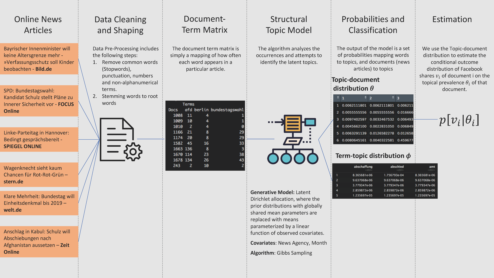
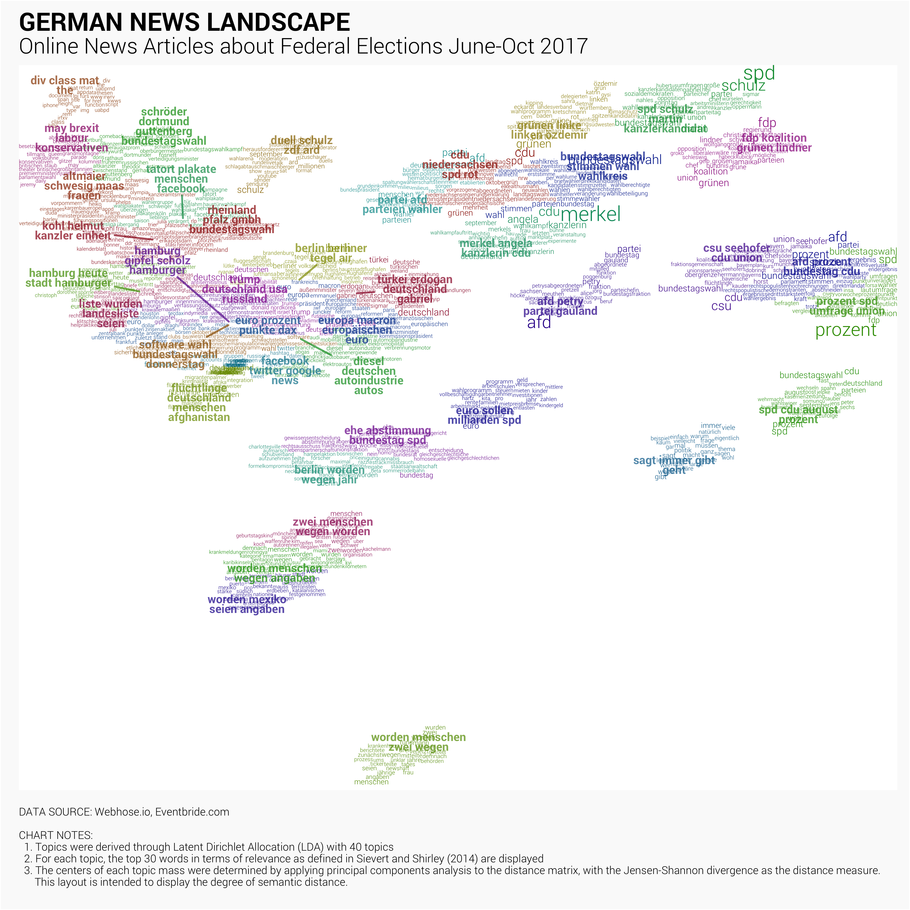

```{r Setup}
suppressPackageStartupMessages({
  library(dplyr)       # Data manipulation
  library(stringr)     # String manipulation
  library(lubridate)   # Date and time manipulation
  library(purrr)       # Functional programming
  library(tidyr)       # Reshaping
  library(magrittr)    # Advanced piping
  library(pushoverr)   # Pushover notifications
  library(doMC)        # Parallel Computing
  library(readr)       # Importing data
  library(tibble)      # Better data frames
  
  library(ggplot2)     # Static data visualization
  library(ggrepel)     # Repel text labels
  library(ggiraph)     # GGplot interactive
  library(scales)      # Scales
  library(viridis)     # Viridis color scales
  library(htmlwidgets) # JS visuliaztions
  library(htmltools)   # Arbitrary html
  library(ggjoy)       # Create joyplots
  library(gganimate)   # Animating ggplots
  library(tweenr)      # Tweening charts
  
  library(httr)        # HTTP functions
  library(jsonlite)    # JSON parsing
  
  library(tidytext)    # Tidy text mining
  library(tm)    # Tidy text mining
  library(hunspell)    # Text processing
  library(stringdist)  # String distances
  library(topicmodels) # Topic modelling
  library(stm)         # Sructural Topic Model
  library(proxy)       # Distance measures
  library(SnowballC)   # Stemming
})

# Theming
quartzFonts(
  Roboto = 
    c("Roboto-Light",
      "Roboto-Bold",
      "Roboto-Regular",
      "Roboto-Thin")
)

theme_set(
  theme_bw(base_family = "Roboto", base_size = 14) +
    theme(
      plot.title = element_text(face = "bold", size = 14, 
                                margin = margin(0, 0, 4, 0, "pt")),
      plot.subtitle = element_text(size = 12),
      plot.caption = element_text(size = 6, hjust = 0),
      axis.title = element_text(size = 10),
      panel.border = element_blank()
    )
)

rm(list=ls())
# Functions
source("func/02-topic-modelling-functions.R")

```

```{r caching, echo = FALSE}
load("../output/models/LDAGibbs 40 .Rda")
#load("../output/btw_combined.Rda")
knitr::opts_chunk$set(eval = TRUE, warning = FALSE)

btw$articleID <- rownames(btw)
```

## Introduction

Social networks such as Facebook are becoming more and more important for online news services: an increasing number of their readers access the news pages via links in the networks. Users of Facebook, for example, can use their profile to share links to external websites - such as news portals - with their online friends. This has led to the development of social media into an important generator of traffic on the internet pages. In Germany, 94\% of online shared news articles in 2015 are distributed via Facebook, followed by Twitter with 3.5\% and Google+ with 2.3\% \citep{schiller_development_2016}. The advertising-financed business model of the media houses is based on the premise that users visit their websites in order to achieve high advertising revenues. For this reason, news agencies are particularly interested in finding out which topics are more likely shared on these platforms. \citet{schiller_development_2016} show, that social media users choose a certain site depending on the researched topic. FOCUS Online for example is targeted for articles from politics and business, sports news is more likely to be shared from Bild.de. 

While these static resorts give an indication on the content of an article, multiple articles in the same resort probably don't cover the same topics (and are not equally shared). Especially if the articles originate from different news portals. Furthermore, articles can contain more than one topic. We use a structural topic model to reveal the underlying topics of a collection of articles (a corpus), and how the articles exhibit them. We then estimate the effect of topic prevalence on the number of Facebook shares. 

## Methodology

Mapping raw text to one or more topics, without having prior knowledge on what those topics are, translates to an unsupervised classification problem on natural language. Within topic models the Latent Dirichlet Allocation (LDA) is a widely used technique, where each document (article) is viewed as a mixture of topics (represented by the document-topic distribution) and each topic is a mixture of unique terms (represented by the topic-term distribution).\cite{blei_latent_2003} 

This model views the text generation process as conforming to the following characteristics: 

  * A topic is a mixture of words. A topic is comprised of many words, and each word maps to one or more topics.
  * A document (in this case, a news article), is a mixture of topics. Each document can be thought of as containing a proportion of words from each topic.

To "learn" the topic prevalence and the topic-term distribution, collapsed Gibbs sampling\footnote{See Section \ref{section_gibbs} for a non-formal description of the Gibbs sampler} can be used. One of the important considerations of this model is that the number of topics $k$ must be known a-priori.



## Dataset

To explore the effect of topic prevalence of an article on the times this article is shared on Facebook, we analyze a sample of 6307 news articles containing the term "Bundestagswahl" (Federal Election) dated from 01.06.2017 to 10.10.2017\footnote{German federal elections took place on 24th of September 2017.} and originated from six different german news sources.\footnote{Bild.de, Focus.de, Spiegel.de, Stern.de, Welt.de, Zeit.de} For each document in our sample, we observe the day it was written, the number of shares on Facebook and the newswire service publishing the article. We include the month the document was written and the news agency as covariates on topical prevalence. We also include news agency as a covariate affecting topical content to estimate how topics are discussed in different ways by different news agencies \citep{roberts_model_2016}.

We can see the number of articles by news agency and the how many of these articles were shared on Facebook on the following figure.

```{r echo=FALSE}
btw$shared <- ifelse(btw$fb_shares == 0, "0", NA)
btw$shared <- ifelse(btw$fb_shares > 0 | btw$fb_shares >= 100, "0-100", btw$shared)
btw$shared <- ifelse(btw$fb_shares > 100, "> 100", btw$shared)

btw %>%
  ggplot(aes(site, fill=shared)) +
  geom_bar(alpha = .7) +
  labs(x="", y="Count") 
```

```{r include=FALSE}
btw %>% 
  # Tokenize by word
  unnest_tokens(word, text_cleaned, token = "words") ->
  # Assign to variable
  posts_tokenized.dt

# Remove short words
posts_tokenized.dt %>% 
  filter(str_length(word) >= 3) ->
  posts_tokenized.dt

# Summarise
posts_tokenized.dt %>% 
  group_by(articleID, word) %>%
  dplyr::summarise(term_frequency = n()) %>%
  ungroup() ->
  posts_tokenized.dt
```

## Analysis

### LDA Training

```{r eval=FALSE, include=FALSE}
# Build Corpus
btw %>%
  filter(nchar(text_cleaned) > 5) -> btw

# Build corpus
df.lda <- Corpus(VectorSource(btw$text_cleaned))
# Create document-term matrix
dtm <- DocumentTermMatrix(df.lda)
# Assign name to docs
rownames(dtm) <- make.unique(btw$title)
```

We then train the LDA on the full dataset, with $k = 40$.

```{r eval=FALSE, include=FALSE}
## Run LDA using Gibbs sampling

#Set parameters for Gibbs sampling (see https://eight2late.wordpress.com/2015/09/29/a-gentle-introduction-to-topic-modeling-using-r/)
burnin <- 1000
iter <- 1000
keep <- 50

k = 40 # Topics
```

```{r eval=FALSE, include=FALSE}
t1 <- Sys.time()
ldaOut <-LDA(dtm, k, method="Gibbs", control=list(burnin=burnin, iter = iter, keep = keep))
t2 <- Sys.time()
t2 - t1

save(ldaOut, btw, dtm, file=paste("../output/models/LDAGibbs",k,".Rda"))
```


#### Topic Labeling

```{r Extract wtp and dtp}

# Word-topic probabilities
ldaOut %>% tidy("beta") -> posts.wtp

# Document-topic probabilities
ldaOut %>% tidy("gamma") -> posts.dtp

```

We can then assess the word-topic probabilities in order to get an idea of the topic that is most.

Since we have over 30,000 unique terms in the corpus, we need to extract the top few words that most uniquely define each topic, so that we can more easily visualize and label them. We use the measure of relevance defined by Sievert and Shirley (2014)^[[Sievert and Shirley (2014). LDAvis: A method for visualizing and interpreting topics. *Stanford University.*](http://nlp.stanford.edu/events/illvi2014/papers/sievert-illvi2014.pdf)]. Relevance of term $w$ to topic $k$ given a weight parameter $\lambda$ between 0 and 1 $r(w, k | \lambda)$ is computed as:

$$
r(w, k | \lambda) = \lambda\log(\phi_{kw}) + (1-\lambda)\log(\frac{\phi_{kw}}{p_w})
$$

where $\phi_{kw}$ is the probability of term $w$ for topic $k$, and $p_w$ is the empirical probability of the word in the corpus. $\lambda$ can be thought of as a weighting term between ranking by the probability of that word within the topic, and ranking by the lift over the overall probability in the corpus.

In user studies, Sievert and Shirley (2004) found that a lambda value of 0.6 as an optimal value for allowing humans to identify the topics associated with the top words ranked by relevance. We use this same value for lambda.

```{r Compute relevance}

posts.wtp %>%
  # Compute lambda and phi_kw
  mutate(lambda = 0.6, phi_kw = beta) %>% 
  # Compute and join the p_w
  left_join(
    posts_tokenized.dt %>%
      group_by(word) %>% 
      dplyr::summarise(frequency = sum(term_frequency)) %>% 
      ungroup() %>% 
      mutate(p_w = frequency/sum(frequency)) %>% 
      select(-frequency),
    by = c("term" = "word")
  ) %>%
  # Compute the relevance
  mutate(relevance = lambda * log(phi_kw) + (1 - lambda) * log(phi_kw/p_w)) ->
  word_relevance.dt

```

```{r Loading topic mappings}
### Most likely Topics per Article

# The topics function from the package is used to extract the most likely topic for each document 
btw.topics <- topics(ldaOut, 2)

# Create Dataframe
doctopics.df <- as.data.frame(t(btw.topics))

doctopics.df %>%
  transmute(title = rownames(.),
            topic = V1) -> doctopics.df

doctopics.df$articleID <- as.integer(rownames(doctopics.df))

# Add Topic to origian DF
topics_mapping.dt <- btw %>%
  mutate(articleID = as.integer(articleID)) %>%
  inner_join(.,doctopics.df, by="articleID") %>%
  
  group_by(topic) %>%
  slice(1) %>%
  select(topic, title.text, articleID) 
```

```{r message=FALSE, warning=FALSE}
### Create Topic Labels

## Return the top 30 terms.
btw.terms <- as.data.frame(terms(ldaOut, 30), stringAsFactors = FALSE)


topicTerms <- btw.terms %>% gather(Topic)
topicTerms <- cbind(topicTerms, Rank = rep(1:30))
topicTerms <- topicTerms %>% filter(Rank < 5)

topicTerms <- topicTerms %>% mutate(topic = stringr::word(Topic, 2))
topicTerms$topic <- as.numeric(topicTerms$topic)

topicLabel <- data.frame()
for (i in 1:40){
  z <- dplyr::filter(topicTerms, topic==i)
  l <- as.data.frame(paste(z[1,2], z[2,2], z[3,2], z[4,2], sep = " "), stringAsFactors = FALSE)
  topicLabel <- rbind(topicLabel, l)
}
colnames(topicLabel) <- c("topic_name")
topicLabel$topic <- as.integer(rownames(topicLabel))
```

```{r}
## Combine with Topic label
topics_mapping.dt %>%
  left_join(., topicLabel, by="topic") -> topics_mapping.dt
```

### Sample articles

To test, wheather the topic classification make sense, we pull out sample articles classified by the model to see if they match the assigned topic.


Now that we have labelled each topic, we produce sample documents classified to that topic for reference. We produce a random sample of 10 posts from the 300 highest probability fits per topic.

```{r Document classification}

set.seed(9272)
posts.dtp %>% 
  group_by(title = document) %>% 
  summarise(topic = min(topic[gamma == max(gamma)]), gamma = max(gamma)) %>% 
  ungroup() %>% 
  inner_join(btw %>% select(title, articleID), by = "title") %>% 
  inner_join(topics_mapping.dt, by = "topic") %>% 
  mutate(topic_title = 
           paste0("Topic ", formatC(topic, flag = "0", width = 2), 
                  " - ", topic_name)) %>% 
  group_by(topic_name) %>% 
  top_n(300, gamma) %>%
  sample_n(5, replace = TRUE) %>% 
  mutate(row = row_number()) %>% 
  ungroup() ->
  posts_classification.sdt

```

We produce a chart that shows this in a presentable manner.

```{r Document classification chart, eval=FALSE, include=FALSE}

ggsave(
  plot = {
    posts_classification.sdt %>% 
      ggplot(aes(x = 0, y = row, color = factor(topic, levels = 1:40))) +
      facet_wrap(~topic_title, ncol = 5) +
      geom_text(
        aes(label = title),
        size = 2, hjust = 0, family = "Roboto"
      ) +
      geom_point(aes(x = -0.025), size = 0.5) +
      scale_x_continuous(limits = c(-0.05, 1), expand = c(0, 0)) +
      scale_color_manual(
        values = rainbow(40) %>% 
          adjustcolor(red.f = 0.6, green.f = 0.6, blue.f = 0.6)
      ) +
      theme(
        axis.title       = element_blank(),
        axis.text        = element_blank(),
        axis.ticks       = element_blank(),
        panel.grid       = element_blank(),
        strip.background = element_blank(),
        panel.border     = element_blank(),
        strip.text       = element_text(face = "bold", hjust = 0, size = 6),
        plot.background  = element_rect(fill = "#FAFAFA"),
        legend.position  = "none"
      ) +
      labs(
        title    = "GERMAN NEWS LANDSCAPE",
        subtitle = "Sample online news articles in the year 2017",
        caption  = 
"DATA SOURCE: Webhose.io, Eventbride.com

CHART NOTES:
  1. Topics were derived through Latent Dirichlet Allocation (LDA) with 40 topics
  2. Documents were classified according to the topic that has the highest probability
"
      )
  },
  device = "png",
  filename = "../figs/02-topic-classification-sample.png",
  dpi = 600, height = 10, width = 16
)

```


### News landscape 

After performing the topic modeling, we can generate an overview of the news landscape about the german elections, each group is composed of the most relevant words for that topic, and a manually-determined label. The distances that the topics have from each other reflect their semantic distance, or basically how different the words are for that topic. It is computed as the Jensen-Shannon divergence between each of the topics according to the differences in their word-topic probabilities. We then apply principal coordinates analysis in order to project the distance matrix down to two dimensions.

```{r eval=FALSE, include=FALSE}
posts.wtp %>% 
  # Compute Jensen-Shannon
  computeJensenShannonPCA() %>% {
    
    # Assign positions to top 30 most relevant words
    left_join(
      .,
      word_relevance.dt %>% 
        group_by(topic) %>% 
        top_n(30, relevance) %>% 
        ungroup(),
      by = "topic"
    ) -> topic_labelling_top30words.dt
    
    # Assign positions to topic labels
    left_join(
      .,
      topics_mapping.dt,
      by = "topic"
    ) -> topic_labelling_topics.dt
    
    ggsave(
      plot = {
        topic_labelling_top30words.dt %>% 
          ggplot(aes(x = x, y = y)) +
          geom_text_repel(
            aes(label = term, 
                color = factor(topic, levels = 1:40), 
                size = phi_kw * p_w), 
            lineheight = 0.6, 
            segment.size = NA,
            box.padding = unit(0, "lines"),
            force = 0.05,
            family = "Roboto"
          ) +
          geom_text_repel(
            data = topic_labelling_topics.dt,
            aes(label = str_wrap(topic_name, 15),
                color = factor(topic, levels = 1:40)),
            size = 2.25, lineheight = 0.7,
            segment.size = 0.5, alpha = 0.7,
            family = "Roboto", fontface = 2,
            force = 0.3
          ) +
          scale_size_continuous(range = c(1, 4)) +
          scale_color_manual(
            values = rainbow(40) %>% 
              adjustcolor(red.f = 0.6, green.f = 0.6, blue.f = 0.6)
          ) +
          theme(
            axis.title = element_blank(),
            axis.text  = element_blank(),
            axis.ticks = element_blank(),
            panel.grid = element_blank(),
            panel.border = element_blank(),
            plot.background = element_rect(fill = "#FAFAFA"),
            legend.position = "none"
          ) +
          labs(
            title    = "GERMAN NEWS LANDSCAPE",
            subtitle = "Online News Articles about Federal Elections June-Oct 2017",
            caption = 
"DATA SOURCE: Webhose.io, Eventbride.com

CHART NOTES:
  1. Topics were derived through Latent Dirichlet Allocation (LDA) with 40 topics
  2. For each topic, the top 30 words in terms of relevance as defined in Sievert and Shirley (2014) are displayed
  3. The centers of each topic mass were determined by applying principal components analysis to the distance matrix, with the Jensen-Shannon divergence as the distance measure. 
      This layout is intended to display the degree of semantic distance.
"
          )
      },
      filename = "../figs/01-news-landscape-map.png",
      device = "png",
      dpi = 600
    )
    
  }

```



### Topic Trends

We classify each document based on which topic has the highest probability. If one or more topics have equal probability, then the count is assigned equally to all the topics.

```{r Topic classification}

posts.dtp %>% 
  group_by(document) %>% 
  filter(gamma == max(gamma)) %>% 
  mutate(allocation = 1/n()) %>% 
  ungroup() ->
  posts_classification.dt

```

We construct a chart that allows us to explore topic trends, both in terms of document count and the total number of reactions on the articles of that particular topic.

```{r Data for topic trends chart}

set.seed(7292)
posts_classification.dt %>% 
  # Add post information
  inner_join(
    btw %>% 
      select(document = title, date, 
             title, articleID) %>% 
      mutate(post_period = 
               date %>% 
               with_tz("Europe/Paris") %>% 
               floor_date("week")),
    by = "document"
  ) %>%
  # Add topic information
  left_join(topics_mapping.dt, by = "topic") %>%
  # Summarise into tidy dataframe
  group_by(post_period, topic_name) %>% 
  summarise(
    articles = sum(allocation),
    sample_articles = 
      paste0("<li>", sample(document, 3, replace = TRUE ), "</li>", collapse = "<br>")
  ) %>% 
  ungroup() %>% 
  mutate(
    tooltip_text = 
      paste0(
        "<b>", topic_name, "</b> in period of <b>", post_period, "</b><br>",
        "<b>Number of Articles:</b> ", comma(round(articles, 0)), "<br>",
        "<b>Sample Articles:</b><br><ul>", sample_articles, "</ul>"
      )
  ) %>% 
  # Mark peaks 
  group_by(topic_name) %>% 
  mutate_at(
    vars(articles), 
    funs(mean = mean(.), sd = sd(.), zscore = (. - mean(.))/sd(.))
  ) %>% 
  ungroup() %>% 
  mutate_at(
    vars(ends_with("zscore")),
    funs(peak = . >	1.96)
  ) %>% 
  mutate(tooltip_text = str_replace_all(tooltip_text, "'", "")) ->
  chart_topic_trends.dt
```

```{r Topic trends chart, eval = TRUE}

{
  chart_topic_trends.dt %>% 
    ggplot(
      aes(
        x = post_period, 
        y = factor(
          topic_name, 
          chart_topic_trends.dt %>% 
            group_by(topic_name) %>% 
            summarise(post_period = mean(post_period[peak], na.rm = TRUE)) %>% 
            ungroup() %>% 
            arrange(desc(post_period)) %$%
            unique(topic_name)
        )
      )
    ) +
    geom_tile_interactive(aes(tooltip = tooltip_text, fill = log(articles))) +
    geom_point_interactive(
      mapping = aes(tooltip = tooltip_text),
      data = chart_topic_trends.dt %>% filter(peak),
      color = "red"
    ) +
    scale_fill_viridis(
      labels = function(x) comma(round(exp(x))), 
      name = "Number of Articles",
      option = "plasma"
    ) +
    scale_x_datetime(expand = c(0, 0)) +
    labs(
      title = "ZEITGEIST", 
      subtitle = "Topic distribution of news articles over time, 2017\n(Hover over each tile to see sample articles)",
      caption = "
DATA SOURCE: Webhose.io, Eventbride.com

CHART NOTES:
  1. Red dots indicate weeks where the number of articles exceeds 1.96 SD above mean for that topic
  2. Hover over each tile to see infomration and to see sample articles
  3. Topics were derived through Latent Dirichlet Allocation (LDA) with 40 topics
  4. Articles were classified according to the topic that has the highest probability

TROY JAMES PALANCA | TJPALANCA.COM
      "
    ) +
    theme(
      legend.position   = "bottom",
      legend.key.width  = unit(0.1, "npc"),
      legend.background = element_rect("#fafafa"),
      plot.background   = element_rect("#fafafa", "#fafafa"),
      plot.title        = element_text(size = 18),
      plot.subtitle     = element_text(size = 8),
      plot.caption      = element_text(size = 7),
      panel.grid        = element_blank(),
      panel.background  = element_rect("#fafafa"),
      axis.title        = element_blank(),
      axis.ticks        = element_blank(),
      axis.text.y       = element_text(size = 8)
    ) 
} %>% 
  ggiraph(
    ggobj = .,
    # width_svg  = 8,
    # height_svg = 7,
    width = 1,
    tooltip_extra_css = "
    font-family: Roboto; 
    background-color: #000; 
    color: #fff; font-size: 10px;
    padding: 5px;"
  ) %>% 
  prependContent(
    tags$link(
      href = "https://fonts.googleapis.com/css?family=Roboto:400,700", 
      rel = "stylesheet"
    )
  ) -> chart_topic_trends.wdgt

saveWidget(
  widget = chart_topic_trends.wdgt,
  file = "../figs/03-topic-trends.html",
  selfcontained = FALSE,
  libdir = "../figs/js",
  background = "#fafafa"
)

chart_topic_trends.wdgt

```

```{r Topic trends line chart, eval = TRUE}

{ 
  chart_topic_trends.dt %>%
  select(post_period, topic_name, articles) %>% 
  mutate(data_id = row_number() %>% as.character()) %>% 
  ggplot(aes(x = post_period, y = articles)) +
  geom_path_interactive(
    aes(group = topic_name, 
        tooltip = str_replace_all(topic_name, "'", ""),
        data_id = data_id), 
    color = "gray"
  ) +
    scale_y_continuous(labels = comma) +
    labs(
      title = "PEAKS AND TROUGHS",
      subtitle = "Hover over each line to see the trend of news articles for a particular topic",
      y = "Number of Articles"
    ) +
    theme(
      plot.background   = element_rect("#fafafa", "#fafafa"),
      plot.title        = element_text(size = 18),
      plot.subtitle     = element_text(size = 8),
      plot.caption      = element_text(size = 7),
      panel.grid        = element_blank(),
      panel.background  = element_rect("#fafafa"),
      axis.title.x      = element_blank(),
      axis.text.y       = element_text(size = 8)
    )
} %>% 
  ggiraph(
    ggobj = .,
    hover_css = "stroke: red; stroke-width: 3px;",
    width = 1,
    width_svg = 8,
    height_svg = 4,
    tooltip_extra_css = "
    font-family: Roboto; 
    background-color: #000; 
    color: #fff; font-size: 10px;
    padding: 5px;"
  ) %>% 
  prependContent(
    tags$link(
      href = "https://fonts.googleapis.com/css?family=Roboto:400,700", 
      rel = "stylesheet"
    )
  ) -> chart_trends_line.wdgt

saveWidget(
  widget = chart_trends_line.wdgt,
  file = "../figs/06-topic-trends-line.html",
  selfcontained = FALSE,
  libdir = "../figs/js",
  background = "#fafafa"
)

chart_trends_line.wdgt

```

```{r Trend to reactions, eval = TRUE}

# Prepare dataset for joy plot
posts_classification.dt %>% 
  inner_join(
    btw %>% 
      select(
        document = title, 
        news_page = site, 
        title, 
        date
      ),
    by = "document"
  ) %>% 
  inner_join(topics_mapping.dt, by = "topic") %>% 
  inner_join(
    btw %>% 
      group_by(document = title) %>%
      summarise(reactions = sum(fb_shares)) %>%
      ungroup(),
    by = "document"
  ) %>%
  group_by(
    topic_name, 
    # 8 hour time difference (Manila)
    week = floor_date(date, "week")
  ) %>% 
  summarise(
    num_articles  = sum(allocation),
    num_reactions = sum(reactions * allocation)
  ) %>%
  #mutate(peak = week[num_articles == max(num_articles)]) %>%
  ungroup() %>%
  arrange(week) %>%
  mutate(
    topic_name = factor(topic_name, levels = rev(unique(topic_name))),
    # ID needed for linking back information after tweening frames
    id = as.character(row_number()),
    # Maximum height for ridgeline is 9
    articles_height = num_articles/max(num_articles) * 9,
    reactions_height = num_reactions/max(num_reactions) * 9
  ) ->
  posts_time_trend.dt

# Prepare animated dataset
bind_rows(
  # Articles
  posts_time_trend.dt %>% 
    transmute(id, time = 0,  ht = articles_height , op = 0),
  # Reactions
  posts_time_trend.dt %>% 
    transmute(id, time = 10, ht = reactions_height, op = 1),
  # Return to articles
  posts_time_trend.dt %>% 
    transmute(id, time = 20, ht = articles_height , op = 0)
) %>%
  # Add cubic easing
  mutate(ease = "cubic-in-out") %>%
  tween_elements("time", "id", "ease") %>%
  # Add back the topic name and week
  inner_join(
    posts_time_trend.dt %>% select(topic_name, week, id), 
    by = c(".group" = "id")
  ) ->
  posts_time_trend.adt

# Create labels above the chart (what news outlets post vs what we react to)
posts_time_trend.adt %>%
  group_by(.frame) %>%
  summarise(
    opacity    = mean(op),
    range_week = max(week) - min(week),
    min_week   = min(week),
    num_topics = n_distinct(topic_name)
  ) %>% 
  ungroup() -> 
  posts_time_trend_labels.adt

```

```{r Trend to reactions plot, eval = TRUE}

# Create animated pot
posts_time_trend.adt %>%
  ggplot(aes(x = week, y = topic_name, height = ht, 
             fill = topic_name, frame = .frame)) +
  geom_ridgeline(color = NA, alpha = 0.5) +
  geom_text(
    data = posts_time_trend_labels.adt,
    aes(x = min_week + 0.25 * range_week, 
        y = num_topics + 3.5, 
        alpha = 1 - opacity, 
        frame = .frame),
    label = "What news outlets publish", color = "forestgreen",
    family = "Roboto", fontface = "bold", size = 9,
    inherit.aes = FALSE
  ) +
  geom_text(
    data = posts_time_trend_labels.adt,
    aes(x = min_week + 0.75 * range_week, 
        y = num_topics + 3.5, 
        alpha = opacity, 
        frame = .frame),
    label = "What we react to", color = "firebrick",
    family = "Roboto", fontface = "bold", size = 9,
    inherit.aes = FALSE
  ) +
  geom_text(
    data = posts_time_trend_labels.adt,
    aes(x = min_week + 0.55 * range_week, 
        y = num_topics + 3.5, 
        frame = .frame),
    label = "VS",
    family = "Roboto", fontface = "bold", size = 7,
    inherit.aes = FALSE
  ) +
  scale_x_datetime(expand = c(0, 0)) +
  theme(
    legend.position = "none",
    panel.border    = element_blank(),
    axis.title      = element_blank(),
    panel.grid.major.x = element_blank(),
    panel.grid.minor.x = element_blank(),
    plot.caption      = element_text(size = 9)
  ) + 
  labs(
    caption = "
DATA SOURCE: Webhose.io, Eventbride.com
CHART NOTE: Topics were derived through Latent Dirichlet Allocation (LDA) with 40 topics for online news articles in 2017 containing the term 'Bundestagswahl'
    "
  ) ->
  posts_time_trend.agg

gganimate(
  p = posts_time_trend.agg,
  filename = "../figs/09-reactions-vs-articles.gif",
  title_frame = FALSE,
  interval = 1/10,
  ani.width = 900,
  ani.height = 600
)

```


### Topic Distribution by News Page

#### Distribution 

A common accusation leveled against traditional news media is the amount of bias in reporting various topics. We try to explore the topic distribution of news articles.

```{r Data for topic distribution chart}

set.seed(7292)
posts_classification.dt %>% 
  inner_join(
    btw %>% select(document = title, news_page = site, title),
    by = "document"
  ) %>%
  inner_join(topics_mapping.dt, by = "topic") %>% 
  group_by(news_page, topic_name) %>%
  summarise(
    articles = sum(allocation),
    sample_articles = 
      paste0(
        "<li>", sample(document, pmin(3, length(document))), "</li>",
        collapse = "<br>"
      )
  ) %>%
  ungroup() %>% 
  group_by(news_page) %>% 
  mutate(perc_articles = articles/sum(articles)) %>% 
  ungroup() %>%
  # left_join(
  #   top_100_fbpages.dt %>% select(news_page = page_name, page_title), 
  #   by = "news_page"
  # ) %>% 
  mutate(
    tooltip_text = 
      paste0(
        "<b>", comma(round(articles, 0)), " (", percent(perc_articles), 
        ") </b> of articles from <b>", news_page, 
        "</b> fall under <b>", topic_name, "</b><br><br>Sample Articles:<br><ul>",
        sample_articles, "</ul>"
      ) %>% str_replace_all("'", "")
  ) ->
  news_page_distribution.dt
```

```{r Topic distribution chart, eval = TRUE}
{
  news_page_distribution.dt %>% 
    ggplot(aes(x = news_page, y = perc_articles, fill = topic_name)) +
    geom_bar_interactive(
      aes(tooltip = tooltip_text),
      position = position_stack(), 
      stat = "identity", color = "darkgray"
    ) +
    scale_y_continuous(
      name = "Percent of Articles", 
      labels = percent,
      expand = c(0, 0)
    ) +
    theme(
      legend.position = "none",
      axis.title.y = element_blank(),
      legend.background = element_rect("#fafafa"),
      plot.background   = element_rect("#fafafa", "#fafafa"),
      plot.subtitle     = element_text(size = 8),
      plot.caption      = element_text(size = 7),
      plot.title        = element_text(size = 18)
    ) +
    coord_flip() +
    scale_fill_viridis(discrete = TRUE) +
    labs(
      title = "BIAS AND BALANCE",
      subtitle = "Topic distribution of online news articles per news page, 2017\n(Hover over each bar to see the topic and sample articles)",
      caption = "
DATA SOURCE: Facebook Graph API

CHART NOTES:
  1. The news pages are arranged in descending order in terms of number of articles
  2. Topics were derived through Latent Dirichlet Allocation (LDA) with 40 topics
  3. Articles were classified according to the topic that has the highest probability
      "
    )
} %>% 
  ggiraph(
    ggobj = .,
    width_svg = 12,
    height_svg = 8,
    width = 1,
    tooltip_extra_css = "
    font-family: Roboto; 
    background-color: #000; 
    color: #fff; font-size: 10px;
    padding: 5px;"
  ) %>% 
  prependContent(
    tags$link(
      href = "https://fonts.googleapis.com/css?family=Roboto:400,700", 
      rel = "stylesheet"
    )
  ) -> chart_topic_distribution.wdgt

saveWidget(
  widget = chart_topic_distribution.wdgt,
  file = "../figs/04-topic-distribution-pages.html",
  selfcontained = FALSE,
  libdir = "../figs/js",
  background = "#fafafa"
)

chart_topic_distribution.wdgt

```


#### Topic Concentration

A common criticism leveled against news media sites is that there is undue emphasis on a particular topic. One way to measure concentration across different topics is the Herfindahl-Hirschman Index (HHI) which is simply $\Sigma_n{s^2}$ where $s$ is the share of each topic.

```{r Topic concentration chart, eval = TRUE}

{
  news_page_distribution.dt %>% 
    group_by(news_page) %>% 
    arrange(desc(articles)) %>% 
    summarise(
      hh_index  = sum(perc_articles ^ 2),
      t3_topics = paste0(topic_name %>% head(3), collapse = "<br>")
    ) %>% 
    ungroup() %>% 
    arrange(hh_index) %>% 
    mutate(news_page = factor(news_page, unique(news_page))) %>% 
    ggplot(aes(x = news_page, y = hh_index * 100)) +
    geom_bar_interactive(
      aes(
        tooltip = 
          paste0("<b>Top Topics:</b><br>", t3_topics) %>% 
          str_replace_all("'", "")
      ),
      stat = "identity", 
      fill = c("#008B45")
    ) +
    geom_text(aes(label = comma(round(hh_index * 100, 1))), hjust = 1.5, 
              color = "white", family = "Roboto") +
    scale_y_log10(
      name = "Herfindahl-Hirschman Index (HHI)\n(100 = most concentrated)",
      expand = c(0, 0)
    ) +
    labs(
      title = "TOPIC CONCENTRATION OF PHILIPPINE NEWS PAGES",
      subtitle = "Herfindahl-Hirschman Index (HHI)",
      caption = "
DATA SOURCE: Facebook Graph API

CHART NOTES:
  1. Hover over each tile to see infomration and to see top topics
  2. Topics were derived through Latent Dirichlet Allocation (LDA) with 40 topics
  3. Articles were classified according to the topic that has the highest probability

TROY JAMES PALANCA | TJPALANCA.COM
      "
    ) +
    coord_flip() +
    theme(
      axis.title.y       = element_blank(),
      panel.grid.major.y = element_blank(),
      plot.background   = element_rect("#fafafa", "#fafafa"),
      plot.subtitle      = element_text(size = 10),
      plot.caption       = element_text(size = 8),
      plot.title         = element_text(size = 16)
    )
} %>% 
  ggiraph(
    ggobj = .,
    width_svg = 10,
    height_svg = 8,
    width = 1,
    tooltip_extra_css = "
    font-family: Roboto; 
    background-color: #000; 
    color: #fff; font-size: 16px;
    padding: 5px;"
  ) %>% 
  prependContent(
    tags$link(
      href = "https://fonts.googleapis.com/css?family=Roboto:400,700", 
      rel = "stylesheet"
    )
  ) -> chart_topic_concentration.wdgt

saveWidget(
  widget = chart_topic_concentration.wdgt,
  file = "../figs/05-topic-concentration.html",
  selfcontained = FALSE,
  libdir = "../figs/js",
  background = "#fafafa"
)

chart_topic_concentration.wdgt

```

