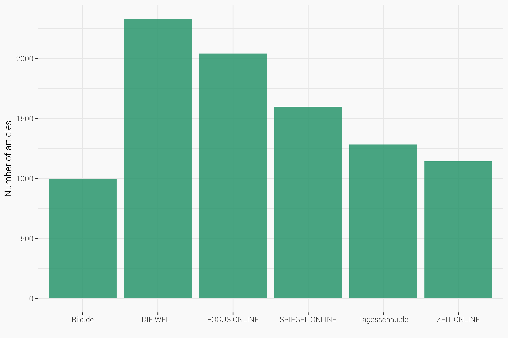
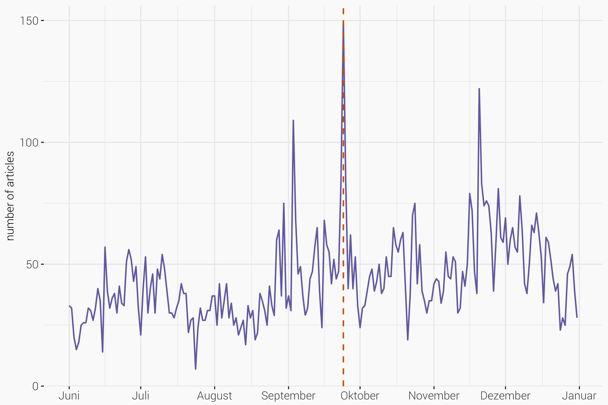
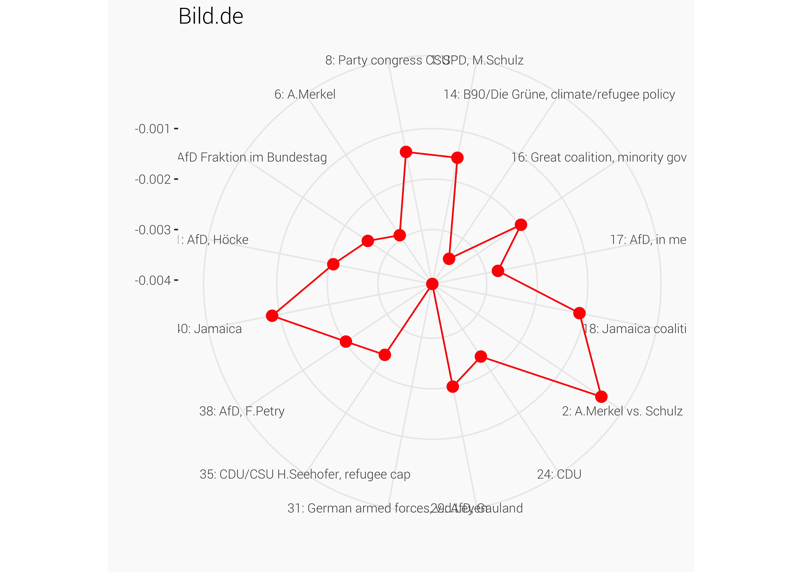
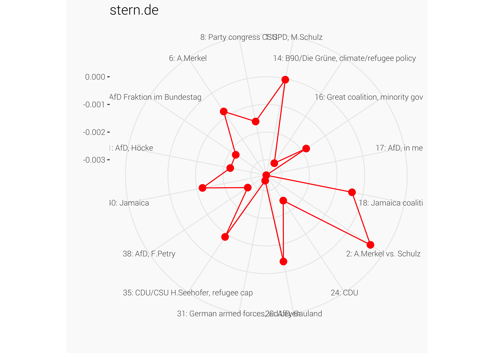
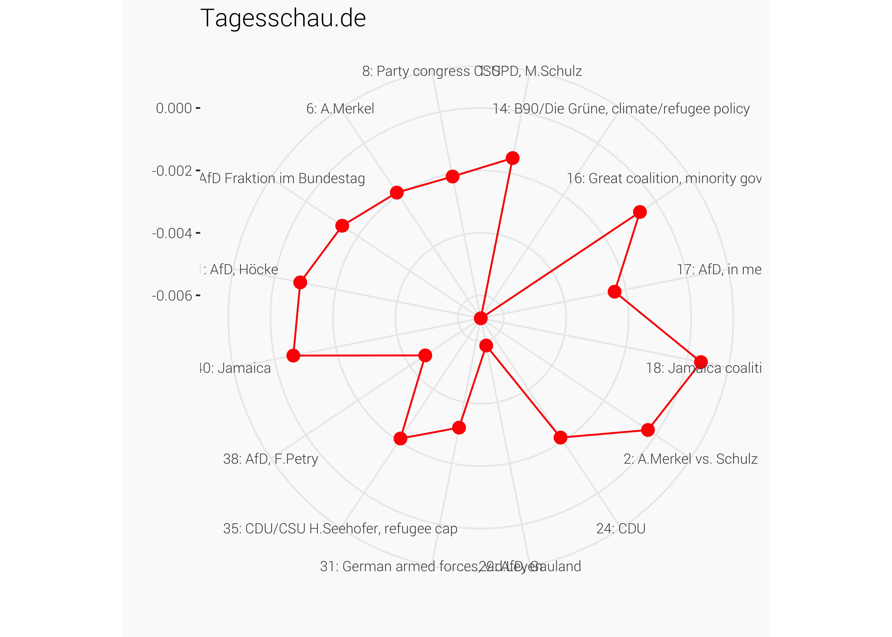

```{r include=FALSE}
library(ggplot2)     # Static data visualization
library(dplyr)       # Data manipulation
library(stringr)     # String manipulation
library(lubridate)   # Date and time manipulation
library(purrr)       # Functional programming
library(tidyr)       # Reshaping
library(magrittr)    # Advanced piping
library(pushoverr)   # Pushover notifications
library(readr)       # Importing data
library(data.table)
library(stm)
library(readxl)
library(Matrix)

library(igraph)
library(corrplot)
library(patchwork)
library(ggpmisc)
library(ggraph)
library(ggiraph)
library(tidygraph)
library(RColorBrewer) 
library(ggrepel)
library(scales)      # Scales
library(viridis)     # Viridis color scales

library(tidytext)    # Tidy text mining
library(stringdist)  # String distances
library(proxy)       # Distance measures

# Theming
quartzFonts(
  Roboto =
    c("Roboto-Light",
      "Roboto-Bold",
      "Roboto-Regular",
      "Roboto-Thin")
)

theme_set(
  theme_bw(base_family = "Roboto", base_size = 10) +
    theme(
      plot.title = element_text(size = 14,
                                margin = margin(0, 0, 4, 0, "pt")),
      plot.subtitle = element_text(size = 8),
      plot.caption = element_text(size = 6),
      plot.background   = element_rect("#fafafa", "#fafafa"),
      panel.background  = element_rect("#fafafa"),
      panel.border = element_blank()
    )
)

rm(list=ls())
col <- brewer.pal(6,"Dark2")
source("func/functions.R")
```

```{r caching, echo = FALSE}
load("../output/btw_out.Rda")
```

I conduct a STM (Strucutral Topic Model) estimation on a sample of 11,919 online news articles from seven news provider about domestic politics: Bild.de, DIE WELT, FOCUS ONLINE, SPIEGEL ONLINE, Stern.de, ZEIT ONLINE, Tagesschau.de. The articles are dated from 01.06.2017 to 31.12.2017 (German federal elections took place on 24th of September 2017.). I first extract all online articles using the the [Eventregistry API](http://eventregistry.org/documentation). Then all articles from the section "domestic policy" are filtered by checking the URL structure.

To discover the latent topics in the corpus, the structural topic modeling (STM) developed by [Roberts (2016)](https://scholar.princeton.edu/sites/default/files/bstewart/files/a_model_of_text_for_experimentation_in_the_social_sciences.pdf) is applied. The STM is an unsupervised machine learning approach that models topics as multinomial distributions of words and documents as multinomial distributions of topics, allowing to incorporate external variables that effect both, topical content and topical prevalence. I will included the news provider as a control for both the topical content and the topical prevalence. Additional, the month an article was published is included as a control for the topical prevalence. The number of topics is set to 35.

## Distribution of articles

The Figures below show the distribution of the number of articles from the respective news sources by date. There is a high peak around the federal elections on September, 24th.  

```{r message=FALSE, warning=FALSE}
ggsave({
  btw %>%
  ggplot(aes(site)) +
  geom_bar(fill=col[1], alpha= .8) +
  labs(x="", y="Number of articles") +
  theme(
      legend.position   = "none"
    )
  
},
filename = "../figs/bar.png", device = "png", 
width = 6, height = 4,
        dpi = 600)
```


```{r message=FALSE, warning=FALSE}
ggsave({
  btw %>%
  group_by(date) %>%
  dplyr::summarise(obs = n()) %>%
  ggplot(aes(date, obs)) +
  geom_line(color=col[3]) +
  geom_vline(aes(xintercept=as.Date("2017-09-24")),
             linetype = 2, color=col[2]) +
  scale_color_manual(values = col) +
  labs(x="", y="number of articles",color="") +
  scale_x_date(breaks = date_breaks("1 month"), labels=date_format("%B", tz="CET")) +
  theme(
      legend.position   = "none",
      axis.title.x      = element_blank(),
      axis.text       = element_text(size = 8)
    )
},
filename = "../figs/timeline.png", device = "png",width = 6, height = 4,
dpi = 600
)

```



# 2. Model Results

```{r echo = FALSE}
load("../output/models/STM 45 .Rda")
k <- stmOut$settings$dim$K
sagelabs <- sageLabels(stmOut, 20)
```

## Label topics

In order to improve readability and traceability, I assign a shorter name to the topics based on the most common words.
The plotQuote function allows to inspect die most common words of a topic for each covariate.

```{r eval=FALSE, fig.height=12, fig.width=5, include=FALSE}
topic <- 45

plotQuote(c(paste(sagelabs$cov.betas[[1]]$problabels[topic,], collapse="\n"),
            paste(sagelabs$cov.betas[[2]]$problabels[topic,], collapse="\n"),
            paste(sagelabs$cov.betas[[3]]$problabels[topic,], collapse="\n"),
            paste(sagelabs$cov.betas[[4]]$problabels[topic,], collapse="\n"),
            paste(sagelabs$cov.betas[[5]]$problabels[topic,], collapse="\n"),
            paste(sagelabs$cov.betas[[6]]$problabels[topic,], collapse="\n"),
            paste(sagelabs$cov.betas[[7]]$problabels[topic,], collapse="\n")))
```

```{r}
topics <- matrix(c(1, "SPD, M.Schulz", 2, "A.Merkel vs. Schulz", 3, "Jamaica, fail of coalition talks, reelections",
                   4, "EU topics: Diesel, Glyphosat, toll", 5, "H.Kohl", 6, "A.Merkel",
                   7, "Federal Election results", 8, "Party congress CSU",
                   9, "Mix: political trends, Macron (FR), EU", 
                   10, "Information on Federal elections (e.g. Wahlomat, election programmes)", 
                   11, "politics & democracy in GER", 12, "Refugees in GER", 13, "Auffangbecken ('Find us on Twitter')", 
                   14, "B90/Die Grüne, climate/refugee policy", 15, "D.Trump, Israel, G20", 
                   16, "Great coalition, minority government", 17, "AfD, in media", 18, "Jamaica coalition talks", 
                   19, "Rubbish", 20, "Mix (Amri, Schmähgedicht Böhmermann)", 21, "German armed forces, Aviation", 
                   22, "Mix (Ditib, Weather, DB)", 23, "Elections in Niedersachsen", 24, "CDU", 
                   25, "Mix (Europa, political talkshows)", 26, "Votes in the Bundestag", 
                   27, "Mix, Surveys, public statistics", 
                   28, "Election polls", 29, "AfD, Gauland", 30, "Sexism, abuse of women & children", 
                   31, "German armed forces, v.d.Leyen", 32, "G20 in Hamburg",
                   33, "Diplomatic relations w Turkey, Russia", 
                   34, "Terror in GER, Left- & Right-wing", 35, "CDU/CSU H.Seehofer, refugee cap",
                   36, "Mix: A.Merkel in Saxony, Weather", 37, "Car industry, Stuttgart, Mix", 38, "AfD, F.Petry", 
                   39, "Statistics, welfare policy", 40, "Jamaica", 41, "AfD, Höcke", 42, "Religion (Muslim, Christ)", 
                   43, "AfD Fraktion im Bundestag", 44, "Ermittlungen Bundesanwaltshaft (NSU, Franco, Terror)", 
                   45, "Berlin capital"), ncol=2, byrow=T)

topics.df <- as.data.frame(topics) %>%
  transmute(topic_name = paste(V1, V2, sep=": "),
         topic = 1:k) 
```

Next, we can assign a topic to each document (topic with highest postertior gamma)

```{r Extract wtp and dtp}
# Document-topic probabilities
stmOut %>% tidy("theta") -> theta

top_topics <- theta %>% 
  group_by(document) %>%
  mutate(therank = rank(-gamma)) %>%
  filter(therank == 1) %>%
  select(- therank)

btw.2 <- btw %>%
  mutate(document = articleID) %>%
  merge(.,top_topics, by="document") %>%
  ## Combine with Topic label
  merge(., topics.df, by="topic") %>%
  mutate(allocation = 1) 
```

##### How is the top-gamma value distributed among the corpus?

```{r}
btw.2 %>%
  ggplot(aes(gamma)) +
  geom_density(color = col[3],
               fill = col[3], alpha=.7) +
  labs(x="Distribution of gamma value")
```

#### Inspect the unclear topics
```{r eval=FALSE, include=FALSE}
btw.2 %>% filter(topic==13) %>% select(title, gamma, url) %>%
  arrange(desc(gamma)) %>%
  top_n(10) %>%
  htmlTable::htmlTable(align="l")
```

## 3.1. Topic proportions

In order to get an initial overview of the results, the figure below displays the topics ordered by their expected frequency across the corpus (left side of the Figure) and the expected proportion of a topic in public media minus the expected proportion of topic use in private media (right side of the Figure). Thus topics more associated with public media appear to the right of zero. To assign a label to each topic, I looked at the most frequent words in that topic and the most representative articles.

Keep only those articles, that are clear & interessting to analyse.

```{r}
keep <- c(1,2,6,8,14,16,17,18,24,29,31,35,38,40,41,43)
```


##### Here, I create a Dataframe that contains the columns means of theta (per topic and covariate level)

```{r}
frequency <- as.data.frame(colMeans(stmOut$theta)) %>%
  mutate(frequency = colMeans(stmOut$theta),
         topic = topics[,1],
         topic_name=paste(topics[,1],topics[,2], 
                          sep=": ")) %>%
  filter(topic %in% keep)

freq <- tapply(stmOut$theta[,1], stmOut$settings$covariates$betaindex, mean)
freq <- as.data.frame(freq) %>% 
    mutate(site=stmOut$settings$covariates$yvarlevels,
           topic = 1)

for(i in 2:k) {
  freq1 <- tapply(stmOut$theta[,i], stmOut$settings$covariates$betaindex, mean)
  freq1 <- as.data.frame(freq1) %>% 
    transmute(site=stmOut$settings$covariates$yvarlevels,
           topic = i,
           freq = freq1)
  
  freq <- rbind(freq, freq1)
}

freq <- freq %>%
  left_join(., topics.df, by = "topic") %>%
  #filter(topic %in% keep) %>%
  mutate(topic = topic_name) %>%
  left_join(., frequency %>% select(topic, frequency),
            by = "topic")
```

#### Next, we can plot the expected proportion of topic use in the overall corpus vs. the expected proportion of topic use for each medium.

```{r fig.height=6}
p1 <- ggplot(frequency, aes(x=reorder(topic_name, frequency), y=frequency)) + 
    geom_col(fill=col[1], alpha=0.8) +
    coord_flip() +
    labs(x="", y="expected frequency") +
    theme(axis.text.x = element_text(size=8),
          axis.text.y = element_text(size=11),
          axis.title = element_text(size=10))

p1
```

```{r fig.height=8, fig.width=12}
p2 <- ggplot(freq, aes(reorder(topic_name,frequency), freq)) +
  geom_col(fill = col[3]) +
  coord_flip() +
  facet_wrap(~site, ncol = 7) +
  theme(
    #axis.text.y = element_blank(),
          axis.text.y = element_text(size=11),
          axis.title = element_text(size=10)) +
    labs(x="", y="expected frequency") 

p2 
```

## 3.2. Difference in topic prevalence

To identify which of these differences is significant, the conditional expectation of topic prevalence for given document characteristics can be estimated. More specifically, I estimate a linear model, where the documents are observations, the dependent variable is the posterior probability of a topic and the covariates are the metadata of documents (see equation below). 

$$
\theta_d=\alpha+\beta_1x_{ownership}+\beta_2x_{month}+\epsilon
$$

The estimateEffect() uses the method of composition to incorporate uncertainty in the dependent variable, drawing a set of topic proportions from the variational posterior repeated times and compute the coefficients as the average over all results.

```{r}
effect <- estimateEffect(c(1:k) ~site+s(month), stmOut, 
                         metadata = out$meta, uncertainty = "None")
```

Here, I create a dataframe that contains the results of the estimation.

```{r}
tables <- vector(mode="list", length = length(effect$topics))

for (i in seq_along(effect$topics)) {
  sims <- lapply(effect$parameters[[i]], function(x) stm:::rmvnorm(500, x$est, x$vcov))
  sims <- do.call(rbind, sims)
  est <- colMeans(sims)
  se <- sqrt(apply(sims,2, stats::var))
  tval <- est/se
  rdf <- nrow(effect$data) - length(est)
  p <- 2*stats::pt(abs(tval), rdf, lower.tail = FALSE)
  topic <- i
  
  coefficients <- cbind(topic, est, se, tval, p)
  rownames(coefficients) <- attr(effect$parameters[[1]][[1]]$est, "names") 
  colnames(coefficients) <- c("topic", "Estimate", "Std. Error", "t value", "p")
  tables[[i]] <- coefficients
}

out1 <- list(call=effect$call, topics=effect$topics, tables=tables)

coeff <- as.data.frame(do.call(rbind,out1$tables))

coeff <- coeff %>% 
  mutate(parameter = rownames(coeff),
         parameter = gsub("site", "", parameter),
         parameter = ifelse(parameter == "s(month)1", "1_July", parameter),
         parameter = ifelse(parameter == "s(month)2", "2_August", parameter),
         parameter = ifelse(parameter == "s(month)3", "3_September", parameter),
         parameter = ifelse(parameter == "s(month)4", "4_October", parameter),
         parameter = ifelse(parameter == "s(month)5", "5_November", parameter),
         parameter = ifelse(parameter == "s(month)6", "6_December", parameter),
         signifcant = ifelse(p <= 0.5,"yes","no")) %>%
  left_join(., topics.df, by="topic")
```

The following figure shows the regression results for each news page. The coefficients indicate the deviation from the base value of Bild.de (keeping the month equal).

```{r fig.height=8, fig.width=12}
p1 <- coeff %>% 
  filter(topic %in% keep) %>%
  filter(parameter %in% stmOut$settings$covariates$yvarlevels) %>%
  ggplot(aes(x = reorder(topic_name,topic, decreasing=F), y = Estimate, fill=factor(signifcant))) +
  geom_col() +
  scale_fill_manual(values = col[c(2,1)]) +
  scale_x_discrete(position = "top") +
  coord_flip() +
  facet_wrap(~parameter, ncol = 8, scales = "free_x") +
  labs(x="", fill="significant at the 5% level") +
  theme(legend.position = "top", 
        axis.text.y = element_text(size=9),
        axis.text.x = element_text(angle=90)) 

p1

# ggsave(plot = p1, filename = "../figs/estimates.png", device = "png",width = 10, height = 7,
# dpi = 600)
```

The following figure shows the regression results for each month. The coefficients indicate the deviation from the base value of June 2017 (keeping the news source).

```{r fig.height=8, fig.width=12}
p1 <- coeff %>% 
  filter(topic %in% keep) %>%
  filter(!parameter %in% stmOut$settings$covariates$yvarlevels) %>%
  filter(parameter != "(Intercept)") %>%
  ggplot(aes(x = reorder(topic_name,topic, decreasing=F), y = Estimate, fill=factor(signifcant))) +
  geom_col() +
  scale_fill_manual(values = col[c(2,1)]) +
  scale_x_discrete(position = "top") +
  coord_flip() +
  facet_wrap(~parameter, ncol = 8, scales = "free_x") +
  labs(x="", fill="significant at the 5% level") +
  theme(legend.position = "top", 
        axis.text.y = element_text(size=9),
        axis.text.x = element_text(angle=90)) 

p1
```

## Sentiment analysis

The idea of Sentiment analysis is to determine the attitude of a writer through online text data toward certain topic or the overall tonality of a document.

Lexical or “bag-ofwords” approaches are commonly used. In that approach, the researcher provides pre-defined dictionaries (lists) of words associated with a given emotion, such as negativity. The target text is then deconstructed into individual words (or tokens) and the frequencies of words contained in a given dictionary are then calculated. 

#### 1. Load sentiment dictionary.

[SentimentWortschatz](http://wortschatz.uni-leipzig.de/de/download), or SentiWS for short, is a publicly available German-language resource for sentiment analysis, opinion mining etc. It lists positive and negative polarity bearing words weighted within the interval of [-1; 1] plus their part of speech tag, and if applicable, their inflections. The current version of SentiWS (v1.8b) contains 1,650 positive and 1,818 negative words, which sum up to 15,649 positive and 15,632 negative word forms incl. their inflections, respectively. It not only contains adjectives and adverbs explicitly expressing a sentiment, but also nouns and verbs implicitly containing one.

```{r}
sent <- c(
  # positive Wörter
  readLines("dict/SentiWS_v1.8c_Negative.txt",
            encoding = "UTF-8"),
  # negative Wörter
  readLines("dict/SentiWS_v1.8c_Positive.txt",
            encoding = "UTF-8")
) %>% lapply(function(x) {
  # Extrahieren der einzelnen Spalten
  res <- strsplit(x, "\t", fixed = TRUE)[[1]]
  return(data.frame(words = res[1], value = res[2],
                    stringsAsFactors = FALSE))
}) %>%
  bind_rows %>% 
  mutate(word = gsub("\\|.*", "", words) %>% tolower,
         value = as.numeric(value)) %>% 
  # manche Wörter kommen doppelt vor, hier nehmen wir den mittleren Wert
  group_by(word) %>% summarise(value = mean(value)) %>% ungroup
```

#### 2. Apply the dictionary on the artciles. 

We now take each word in each article and assign a sentiment value for that word. I only use articles that have been assigned a topic with a probability of over 90% (gamma > 0.9).  

```{r, message=FALSE, warning=FALSE, include=FALSE}
df <- btw.2 %>%
  filter(gamma >= 0.75) %>%
  filter(topic %in% keep)

# Tokenize text
token <- df %>%
  unnest_tokens(word, text)

# Combine with sentiment values
sentDF <- left_join(token, sent, by="word") %>% 
  mutate(value = as.numeric(value)) %>% 
  #filter(!is.na(value)) %>%
  mutate(polarity = ifelse(value < 0, "negative", "NA"),
         polarity = ifelse(value > 0, "positive", polarity))
```

#### 3. Calculate sentiment value by document

calculate sentiment value of document $d$: 

$$
\text{Sentiment}_d = \frac{|\text{Sum of positive tokens}_d| - |\text{Sum of negative tokens}_d|}{\text{Number ot tokens}_d}
$$

```{r}
sentDF.values <- sentDF %>%
  select(document, word, value, polarity) %>%
  mutate(id = row_number()) %>%
  spread(polarity, value) %>%
  group_by(document) %>%
  
  # calculate sum of positive and negative values
  summarise(sum_positive = sum(positive, na.rm = T),
            sum_negative = sum(negative, na.rm = T)) %>%

  # calculate diff
  mutate(sent_diff = abs(sum_positive) - abs(sum_negative)) %>%
  
  # combine with dataframe
  left_join(., df, 
            by = "document") %>%
  # calculate sentiment
  mutate(sentiment = sent_diff / text_length)
```


### Plot Sentiment

#### 1. by topic
```{r fig.height=8, fig.width=6}

p <- sentDF.values %>%
  group_by(topic_name) %>%
  summarise(sentiment = mean(sentiment, na.rm=T),
            obs = n())
  
ggplot(p, aes(reorder(topic_name, sentiment), 
              sentiment)) +
  geom_col(aes(fill=p$obs)) +
  geom_hline(yintercept = 0, linetype = 2,
             color = "black") +
  coord_flip() +
  labs(x="", y="",
       title = "Grouped Sentiment value",
       fill = "Number of\nObservations") +
  theme(axis.text.y = element_text(size = 10))
```


#### 2.by site 

```{r}
p <- sentDF.values %>%
  group_by(site) %>%
  summarise(sentiment = mean(sentiment, na.rm=T),
            obs = n())
  
ggplot(p, aes(reorder(site, sentiment), 
              sentiment)) +
  geom_col(aes(fill=p$obs)) +
  geom_hline(yintercept = 0, linetype = 2,
             color = "black") +
  coord_flip() +
  labs(x="", y="",
       title = "Grouped Sentiment value",
       fill = "Number of\nObservations") +
  theme(axis.text.y = element_text(size = 10))
```

#### 3. By site and topic

```{r fig.height=8, fig.width=12}
p <- sentDF.values %>%
  group_by(site, topic_name, topic) %>%
  summarise(sentiment = mean(sentiment, na.rm=T),
            obs = n())

ggplot(p, 
       aes(reorder(topic_name, topic), 
           sentiment)) +
  geom_col(aes(fill=p$obs)) +
  geom_hline(yintercept = 0, linetype = 2,
             color = "black") +
  coord_flip() +
  facet_wrap(~site, ncol = 7) +
  labs(x="", y="", fill= "Number of\nObservations",
       title = "Sentiment value") +
  theme(axis.text.y = element_text(size=12))
```

### Radar plot

```{r message=FALSE, warning=FALSE}
require(ggiraph)
require(ggiraphExtra)
```

```{r}
sentDF.values %>%
  group_by(site, topic_name) %>%
  summarise(sentiment = mean(sentiment, na.rm=T)) %>%
  spread(key=topic_name, value=sentiment) -> radar

radar %>%
  ggRadar(aes(color=site), 
          rescale = F,
          alpha = 0, legend.position = "right") +
  labs(title = "")
```

```{r}
for (i in stmOut$settings$covariates$yvarlevels) {

  p <-radar %>%
    filter(site == i) %>%
    ggRadar(rescale = F,
            alpha = 0, legend.position = "right") +
    labs(title = i)
  
  ggsave(p, filename = paste0("../figs/radarchart_",i,k,".png"), 
         device = "png", dpi = 600)
  
}

```







