```{r include=FALSE}
library(ggplot2)     # Static data visualization
library(dplyr)       # Data manipulation
library(stringr)     # String manipulation
library(lubridate)   # Date and time manipulation
library(purrr)       # Functional programming
library(tidyr)       # Reshaping
library(magrittr)    # Advanced piping
library(pushoverr)   # Pushover notifications
library(readr)       # Importing data
library(data.table)
library(stm)
library(readxl)
library(Matrix)

library(igraph)
library(corrplot)
library(patchwork)
library(ggpmisc)
library(ggraph)
library(ggiraph)
library(tidygraph)
library(RColorBrewer) 
library(ggrepel)
library(scales)      # Scales

library(tidytext)    # Tidy text mining
library(stringdist)  # String distances
library(proxy)       # Distance measures

# Theming
quartzFonts(
  Roboto =
    c("Roboto-Light",
      "Roboto-Bold",
      "Roboto-Regular",
      "Roboto-Thin")
)

theme_set(
  theme_bw(base_family = "Roboto", base_size = 10) +
    theme(
      plot.title = element_text(size = 14,
                                margin = margin(0, 0, 4, 0, "pt")),
      plot.subtitle = element_text(size = 8),
      plot.caption = element_text(size = 6),
      plot.background   = element_rect("#fafafa", "#fafafa"),
      panel.background  = element_rect("#fafafa"),
      panel.border = element_blank()
    )
)

rm(list=ls())
col <- rcartocolor::carto_pal(12, "Bold")
source("func/functions.R")
```

```{r caching, echo = FALSE}
load("../output/btw_out2.Rda")
```

I conduct a STM (Strucutral Topic Model) estimation on a sample of 14,936 online news articles from seven news provider about domestic politics: Bild.de, DIE WELT, FOCUS ONLINE, SPIEGEL ONLINE, Stern.de, ZEIT ONLINE, Tagesschau.de. The articles are dated from 01.06.2017 to 31.12.2017 (German federal elections took place on 24th of September 2017.). I first extract all online articles using the the [Eventregistry API](http://eventregistry.org/documentation). Then all articles from the section "domestic policy" are filtered by checking the URL structure.

To discover the latent topics in the corpus, the structural topic modeling (STM) developed by [Roberts (2016)](https://scholar.princeton.edu/sites/default/files/bstewart/files/a_model_of_text_for_experimentation_in_the_social_sciences.pdf) is applied. The STM is an unsupervised machine learning approach that models topics as multinomial distributions of words and documents as multinomial distributions of topics, allowing to incorporate external variables that effect both, topical content and topical prevalence. I will included the news provider as a control for both the topical content and the topical prevalence. Additional, the month an article was published is included as a control for the topical prevalence. The number of topics is set to 35.

## Distribution of articles

The Figures below show the distribution of the number of articles from the respective news sources by date. There is a high peak around the federal elections on September, 24th.  

```{r message=FALSE, warning=FALSE}
ggsave({
  btw %>%
  ggplot(aes(site)) +
  geom_bar(fill=col[8], alpha = 0.8) +
  labs(x="", y="Number of articles") +
  theme(
      legend.position   = "none"
    )
  
},
filename = "../figs/bar.png", device = "png", 
width = 6, height = 4,
        dpi = 600)
```


```{r message=FALSE, warning=FALSE}
ggsave({
  btw %>%
  group_by(date) %>%
  dplyr::summarise(obs = n()) %>%
  ggplot(aes(date, obs)) +
  geom_line(color=col[3]) +
  geom_vline(aes(xintercept=as.Date("2017-09-24")),
             linetype = 2, color=col[5]) +
  scale_color_manual(values = col) +
  labs(x="", y="number of articles",color="") +
  scale_x_date(breaks = date_breaks("1 month"), labels=date_format("%B", tz="CET")) +
  theme(
      legend.position   = "none",
      axis.title.x      = element_blank(),
      axis.text       = element_text(size = 8)
    )
},
filename = "../figs/timeline.png", device = "png",width = 6, height = 4,
dpi = 600
)

```


# Model Results

```{r echo = FALSE}
load("../output/models/STM 50 .Rda")
k <- stmOut$settings$dim$K
sagelabs <- sageLabels(stmOut, 20)
```

## 1. Topic

### 1.1. Label topics

In order to improve readability and traceability, I assign a shorter name to the topics based on the most common words.
The plotQuote function allows to inspect die most common words of a topic for each covariate.

```{r eval=FALSE, fig.height=8, fig.width=4}
topic <- 1

plotQuote(c(paste(sagelabs$covnames[1],":", 
                  paste(sagelabs$cov.betas[[1]]$problabels[topic,], collapse="\n")),
            paste(sagelabs$covnames[2],":",
                  paste(sagelabs$cov.betas[[2]]$problabels[topic,], collapse="\n")),
            paste(sagelabs$covnames[3],":", 
                  paste(sagelabs$cov.betas[[3]]$problabels[topic,], collapse="\n")),
            paste(sagelabs$covnames[4],":", 
                  paste(sagelabs$cov.betas[[4]]$problabels[topic,], collapse="\n")),
            paste(sagelabs$covnames[5],":", 
                  paste(sagelabs$cov.betas[[5]]$problabels[topic,], collapse="\n")),
            paste(sagelabs$covnames[6],":",
                  paste(sagelabs$cov.betas[[6]]$problabels[topic,], collapse="\n")),
            paste(sagelabs$covnames[7],":",
                  paste(sagelabs$cov.betas[[7]]$problabels[topic,], collapse="\n"))),
          text.cex = 0.8, width = 40,
          main = paste(topics.df$topic_name[topics.df$topic==topic])
          )
```

```{r}
topics <- matrix(c(1, "SPD", 2, "B90/ Die Grüne & DIE LINKE", 3, "Mix: Akhanli, Guttenberg, Bayern", 4, "Great Coalition debates", 5, "Diesel scandal", 6, "H.Kohl", 7, "Federal Election results", 8, "Europa, Macron, Schäuble", 9, "Mix: political trends, twitter", 10, "Merkel vs. Schulz", 11, "politics & democracy in GER", 12, "Deportation of criminal Refugees", 13, "A.Merkel", 14, "Text processing fail", 15, "Israel, antisemitism, D.Trump", 16, "Mix: political talkshows, Refugees", 17, "Intra-party vote (SPD) about the coalition w CDU/CSU", 18, "Election in Niedersachsen", 19, "R.Lammert", 20, "AfD, Right-wing extremist tendencies", 21, "German armed forces, v.d.Leyen", 22, "SPD, stuffing debates", 23, "CSU, Söder vs. Seehover, refugee cap", 24, "Bundespräsident F.-W.Steinmeier", 25, "Election polls", 26, "Reelections vs. Great Coalition after Jamaica failure", 27, "Jamaica caolition talks", 28, "G20 in Hamburg", 29, "Federal Constitutional Court, Ministry of the Interior", 30, "F.Petri, AfD", 31, "D.Trump, Russia", 32, "Gauland, Weidel, AfD", 33, "German armed forces, Mali", 34, "Mix: Children, Education, Women", 35, "Left- rightwing Terror, police reports", 36, "Mix: people, Germany, democracy", 37, "AfD in parliament", 38, "EU policies", 39, "Mix: Terror attacks", 40, "Mix: Metoo, SPD", 41, "Terror attack Berlin (Amri)", 42, "Refugee family reunion", 43, "Mix: studies", 44, "Federal Constitutional Court (NSU, Franco, Terror)", 45, "Mix: minister of the interior, environment", 46, "CDU, Spahn", 47, "Church", 48, "public (budget) statistics, Education/ Healthcare/ Digital policies", 49, "Turkey", 50, "Höcke, Holocaust"), ncol=2, byrow=T)

topics.df <- as.data.frame(topics) %>%
  transmute(topic_name = paste(V1, V2, sep=": "),
         topic = 1:k) 
```

### 1.2. Posterior distribution (gamma)

The theta Matrix is a DxK Matrix that gives us a probability for each topic (K) and each document (D) 

```{r Extract wtp and dtp}
# Document-topic probabilities
stmOut %>% tidy("theta") -> theta
```

To get a better understanding of the distribution of the "highest gamma", we assign a topic to each document (topic with highest postertior distribution).

```{r}
top_topics <- theta %>% 
  group_by(document) %>%
  mutate(therank = rank(-gamma)) %>%
  filter(therank == 1) %>%
  select(- therank)

btw.2 <- btw %>%
  mutate(document = articleID) %>%
  merge(.,top_topics, by="document") %>%
  ## Combine with Topic label
  merge(., topics.df, by="topic") %>%
  mutate(allocation = 1) 
```

```{r}
ggplot(btw.2, aes(gamma)) +
  geom_density(fill=col[3], alpha = 0.8,
               color = col[3]) +
  labs(title = "Density Plot / Posterior distribution",
       y = "Theta")
```

```{r eval=FALSE, include=FALSE}
# Inspect the unclear topics
btw.2 %>% filter(topic==13) %>% select(title, gamma, url) %>%
  arrange(desc(gamma)) %>%
  top_n(10) %>%
  htmlTable::htmlTable(align="l")
```

### 1.3 Topic proportions

In order to get an initial overview of the results, the figure below displays the topics ordered by their expected frequency across the corpus (left side of the Figure) and the expected proportion of a topic in public media minus the expected proportion of topic use in private media (right side of the Figure). Thus topics more associated with public media appear to the right of zero. To assign a label to each topic, I looked at the most frequent words in that topic and the most representative articles.

```{r}
keep <- seq(1:k)
```


##### Here, I create a Dataframe that contains the columns means of theta (per topic and covariate level)

```{r}
frequency <- as.data.frame(colMeans(stmOut$theta)) %>%
  mutate(frequency = colMeans(stmOut$theta),
         topic = topics[,1],
         topic_name=paste(topics[,1],topics[,2], 
                          sep=": ")) %>%
  filter(topic %in% keep)

freq <- tapply(stmOut$theta[,1], stmOut$settings$covariates$betaindex, mean)
freq <- as.data.frame(freq) %>% 
    mutate(site=stmOut$settings$covariates$yvarlevels,
           topic = 1)

for(i in 2:k) {
  freq1 <- tapply(stmOut$theta[,i], stmOut$settings$covariates$betaindex, mean)
  freq1 <- as.data.frame(freq1) %>% 
    transmute(site=stmOut$settings$covariates$yvarlevels,
           topic = i,
           freq = freq1)
  
  freq <- rbind(freq, freq1)
}

freq <- freq %>%
  left_join(., topics.df, by = "topic") %>%
  #filter(topic %in% keep) %>%
  mutate(topic = topic_name) %>%
  left_join(., frequency %>% select(topic, frequency),
            by = "topic")
```

#### Next, we can plot the expected proportion of topic use in the overall corpus vs. the expected proportion of topic use for each medium.

```{r fig.height=8, fig.width=8}
p1 <- ggplot(frequency, aes(x=reorder(topic_name, frequency), y=frequency)) + 
    geom_col(fill=col[1], alpha=0.8) +
    coord_flip() +
    labs(x="", y="expected frequency") +
    theme(axis.text.x = element_text(size=8),
          axis.text.y = element_text(size=11),
          axis.title = element_text(size=10))

p1
```

```{r fig.height=8, fig.width=12}
p2 <- freq %>%
  mutate(topic =  as.numeric(gsub(":.*$","",topic))) %>% 
  ggplot(aes(reorder(topic_name,topic), freq)) +
  geom_col(fill = col[3]) +
  coord_flip() +
  facet_wrap(~site, ncol = 7) +
  theme(
    #axis.text.y = element_blank(),
          axis.text.y = element_text(size=11),
          axis.title = element_text(size=10)) +
    labs(x="", y="expected frequency") 

p2 
```

```{r eval=FALSE, include=FALSE}
btw.2 %>% filter(topic == 46) %>%
  filter(!grepl("Geißler", title)) %>%
  select(title, url, site) %>%
  htmlTable::htmlTable(align = "l")
```

We will conduct our further analysis on 15 selected topics which relate to political parties.

```{r}
keep <- c(1,2,4,10,13,17,20,22,23,26,27,30,32,37,46)
```

### 1.4. Difference in topic prevalence

To identify which of these differences is significant, the conditional expectation of topic prevalence for given document characteristics can be estimated. More specifically, I estimate a linear model, where the documents are observations, the dependent variable is the posterior probability of a topic and the covariates are the metadata of documents (see equation below). 

$$
\theta_d=\alpha+\beta_1x_{ownership}+\beta_2x_{month}+\epsilon
$$

The estimateEffect() uses the method of composition to incorporate uncertainty in the dependent variable, drawing a set of topic proportions from the variational posterior repeated times and compute the coefficients as the average over all results.

```{r}
effect <- estimateEffect(c(1:k) ~site, stmOut, 
                         metadata = out$meta, uncertainty = "None")
```

Here, I create a dataframe that contains the results of the estimation.

```{r}
tables <- vector(mode="list", length = length(effect$topics))

for (i in seq_along(effect$topics)) {
  sims <- lapply(effect$parameters[[i]], function(x) stm:::rmvnorm(500, x$est, x$vcov))
  sims <- do.call(rbind, sims)
  est <- colMeans(sims)
  se <- sqrt(apply(sims,2, stats::var))
  tval <- est/se
  rdf <- nrow(effect$data) - length(est)
  p <- 2*stats::pt(abs(tval), rdf, lower.tail = FALSE)
  topic <- i
  
  coefficients <- cbind(topic, est, se, tval, p)
  rownames(coefficients) <- attr(effect$parameters[[1]][[1]]$est, "names") 
  colnames(coefficients) <- c("topic", "Estimate", "Std. Error", "t value", "p")
  tables[[i]] <- coefficients
}

out1 <- list(call=effect$call, topics=effect$topics, tables=tables)

coeff <- as.data.frame(do.call(rbind,out1$tables))

coeff <- coeff %>% 
  mutate(parameter = rownames(coeff),
         parameter = gsub("site", "", parameter),
         signifcant = ifelse(p <= 0.5,"yes","no")) %>%
  left_join(., topics.df, by="topic")
```

The following figure shows the regression results for each news page. The coefficients indicate the deviation from the base value of Bild.de (keeping the month equal).

```{r fig.height=4, fig.width=10}
p1 <- coeff %>% 
  filter(topic %in% keep) %>%
  filter(parameter %in% stmOut$settings$covariates$yvarlevels) %>%
  ggplot(aes(x = reorder(topic_name,topic, decreasing=F), y = Estimate, fill=factor(signifcant))) +
  geom_col() +
  scale_fill_manual(values = col[c(2,1)]) +
  scale_x_discrete(position = "top") +
  coord_flip() +
  facet_wrap(~parameter, ncol = 8, scales = "free_x") +
  labs(x="", fill="significant at the 5% level") +
  theme(legend.position = "top", 
        axis.text.y = element_text(size=9),
        axis.text.x = element_text(angle=90)) 

p1

# ggsave(plot = p1, filename = "../figs/estimates.png", device = "png",width = 10, height = 7,
# dpi = 600)
```

## 2. Tone

### 2.1. Plotquote

The plotQuote function allows to inspect die most common words of a topic for each covariate.

```{r eval=FALSE, fig.height=8, fig.width=4}
for (topic in keep) {
  
  png(filename = paste0("../figs/plotquote",topic,".png"), width = 300,
      height = 700)
  
  plotQuote(c(paste(sagelabs$covnames[1],":", 
                  paste(sagelabs$cov.betas[[1]]$problabels[topic,], collapse="\n")),
            paste(sagelabs$covnames[2],":",
                  paste(sagelabs$cov.betas[[2]]$problabels[topic,], collapse="\n")),
            paste(sagelabs$covnames[3],":", 
                  paste(sagelabs$cov.betas[[3]]$problabels[topic,], collapse="\n")),
            paste(sagelabs$covnames[4],":", 
                  paste(sagelabs$cov.betas[[4]]$problabels[topic,], collapse="\n")),
            paste(sagelabs$covnames[5],":", 
                  paste(sagelabs$cov.betas[[5]]$problabels[topic,], collapse="\n")),
            paste(sagelabs$covnames[6],":",
                  paste(sagelabs$cov.betas[[6]]$problabels[topic,], collapse="\n")),
            paste(sagelabs$covnames[7],":",
                  paste(sagelabs$cov.betas[[7]]$problabels[topic,], collapse="\n"))),
          text.cex = 0.8, width = 40,
          main = paste(topics.df$topic_name[topics.df$topic==topic])
          )
  dev.off()
}
```

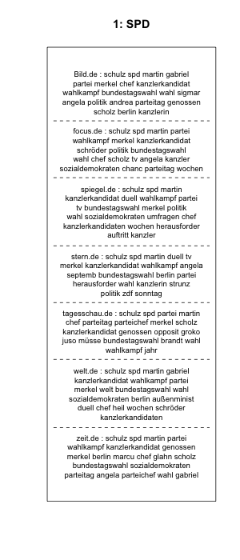
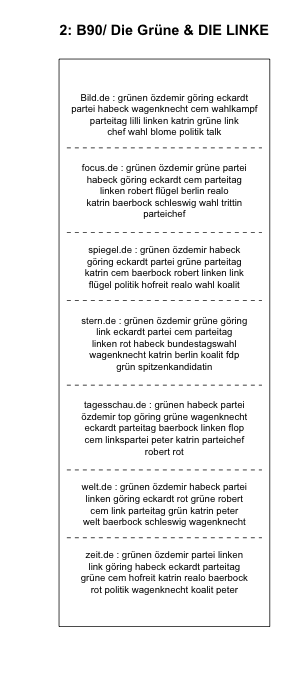
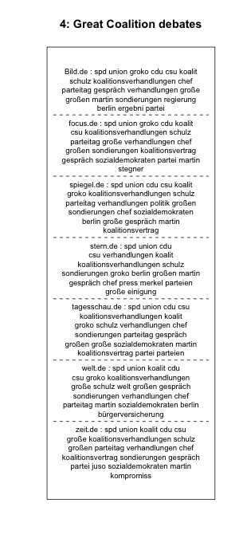
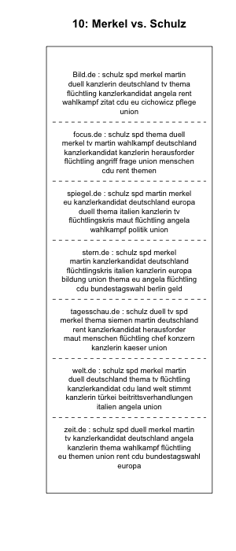
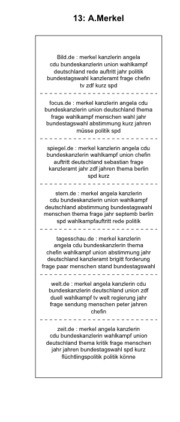
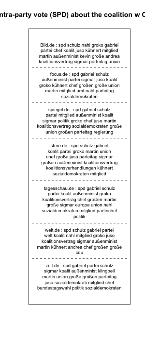
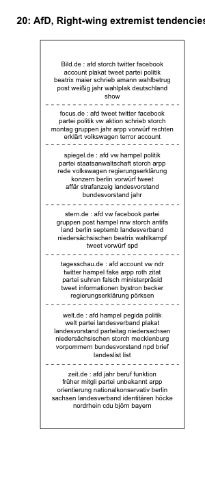
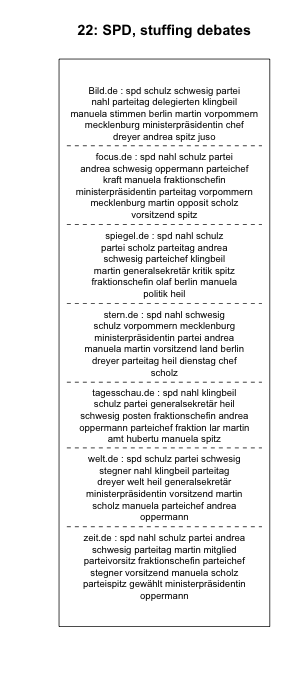
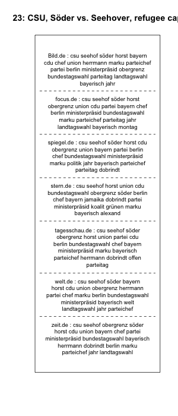
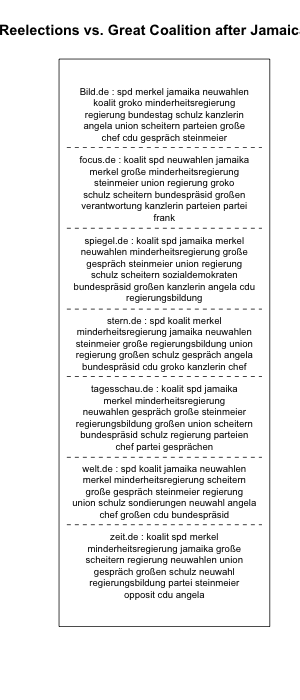
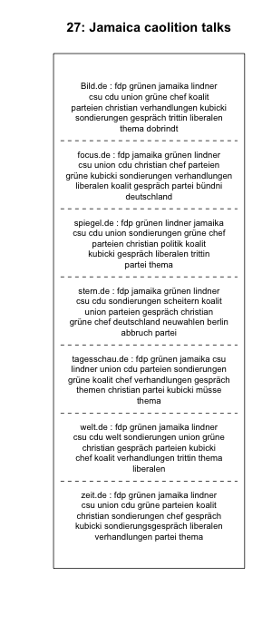
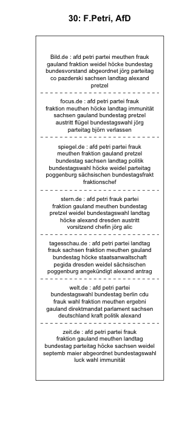
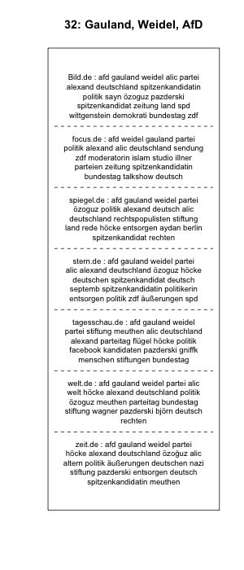
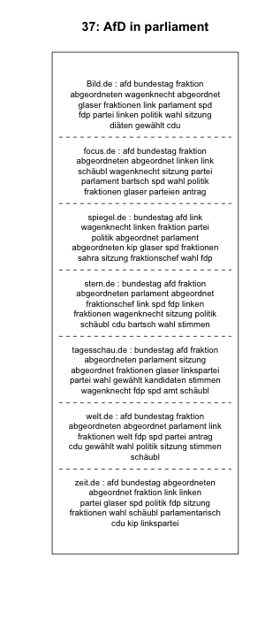
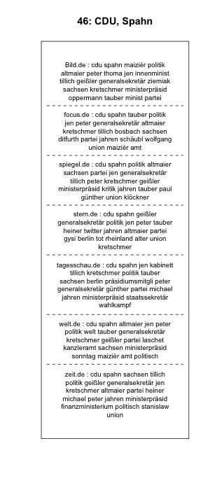


### 2.2. Sentiment analysis

The idea of Sentiment analysis is to determine the attitude of a writer through online text data toward certain topic or the overall tonality of a document.

Lexical or “bag-ofwords” approaches are commonly used. In that approach, the researcher provides pre-defined dictionaries (lists) of words associated with a given emotion, such as negativity. The target text is then deconstructed into individual words (or tokens) and the frequencies of words contained in a given dictionary are then calculated. 

#### 2.2.1. Load sentiment dictionary.

[SentimentWortschatz](http://wortschatz.uni-leipzig.de/de/download), or SentiWS for short, is a publicly available German-language resource for sentiment analysis, opinion mining etc. It lists positive and negative polarity bearing words weighted within the interval of [-1; 1] plus their part of speech tag, and if applicable, their inflections. The current version of SentiWS (v1.8b) contains 1,650 positive and 1,818 negative words, which sum up to 15,649 positive and 15,632 negative word forms incl. their inflections, respectively. It not only contains adjectives and adverbs explicitly expressing a sentiment, but also nouns and verbs implicitly containing one.

```{r}
sent <- c(
  # positive Wörter
  readLines("dict/SentiWS_v1.8c_Negative.txt",
            encoding = "UTF-8"),
  # negative Wörter
  readLines("dict/SentiWS_v1.8c_Positive.txt",
            encoding = "UTF-8")
) %>% lapply(function(x) {
  # Extrahieren der einzelnen Spalten
  res <- strsplit(x, "\t", fixed = TRUE)[[1]]
  return(data.frame(words = res[1], value = res[2],
                    stringsAsFactors = FALSE))
}) %>%
  bind_rows %>% 
  mutate(word = gsub("\\|.*", "", words) %>% tolower,
         value = as.numeric(value)) %>%
  # manche Wörter kommen doppelt vor, hier nehmen wir den mittleren Wert
  group_by(word) %>% summarise(value = mean(value)) %>% ungroup
```

#### 2.2.2. Apply the dictionary on the artciles. 

To carry out the sentiment analysis we filter some documents from the corpus:

  1. Articles that have been assigned a topic with a probability of over 75% (gamma > 0.75).
  2. Articles assigned to one of the above mentioned topics.
  3. Some manual cleanups

After applying these filters, we still have about 2500 articles left to conduct the sentiment analysis. We now take each word in each article and assign a sentiment value for that word.   

```{r, message=FALSE, warning=FALSE, include=FALSE}
df <- btw.2 %>%
  filter(gamma >= 0.75) %>%
  distinct(title, .keep_all = T) %>%
  filter(topic %in% keep) %>%
  # Filter documents about the death of H.Geißler
  filter(!grepl("Geißler", title)) %>%
  # Filter outliner article (wrong topic assignment)
  filter(document != 9725) %>%
  filter(!grepl("Thermilindner", title, ignore.case = T))

# Tokenize text
token <- df %>%
  unnest_tokens(word, text)

# Combine with sentiment values
sentDF <- left_join(token, sent, by="word") %>% 
  mutate(value = as.numeric(value)) %>% 
  #filter(!is.na(value)) %>%
  mutate(negative = ifelse(value < 0, value, NA),
         positive = ifelse(value > 0, value, NA),
         negative_d = ifelse(value < 0, 1, 0),
         positive_d = ifelse(value > 0, 1, 0)) 
```

#### 2.2.3. Check the analysis for a set of example documents. 

```{r}
sentDF %>% filter(document == unique(sentDF$document)[1]) %>%
  select(title, word, value, site) %>%
  htmlTable::htmlTable(align = "l")
```

#### 2.2.4. Calculate sentiment value by document

The sentiment score is calculated based on the weighted polarity values for a word, defined on an interval between -1 and 1. The score is then calculated from the sum of the words in a document (which can be assigned to a word from the dictionary) divided by the total number of words in that document. 
  
$$
\text{Weighted}_d = \frac{|\text{positive polarity score}_d| - |\text{negative polarity score}_d|}{\text{Total Words}_d}
$$
  
```{r}
sentDF.values <- sentDF %>%
  select(document, word, value, 
         negative, positive,
         negative_d, positive_d) %>%
  group_by(document) %>%
  
  # calculate sum of positive and negative values
  summarise(sum_positive = sum(positive, na.rm = T),
            sum_negative = sum(negative, na.rm = T),
            sum_positive_d = sum(positive_d, na.rm = T),
            sum_negative_d = sum(negative_d, na.rm = T)) %>%

  # calculate diff
  mutate(sent_diff = sum_positive + sum_negative,
         sent_diff_d = sum_positive_d - sum_negative_d) %>%
  
  # combine with dataframe
  left_join(., df, 
            by = "document") %>%
  # calculate sentiment
  mutate(sentiment_d = sent_diff_d / text_length,
         sentiment = sent_diff / text_length) %>%
  
  # generate week
  mutate(week = week(date),
         month = as.character(month)) %>%
  mutate(week = paste(month,week, sep = "-"))
```


#### 2.2.5. Plot Sentiment Score

The following figure shows the results of the analysis for each topic on a monthly basis, aggregated on all newspaper. Some conclusions can be drawn from this illustration. First of all, it is clear that topics concerning the AfD (20, 30, 32, 37) are discussed in a negative way over the entire period, with an exepction for topic 30, dealing with Frauk Petry and the AfD. The topic that is discussed most negatively is that of the right-wing extremist tendencies within the AfD. Another striking result is that the sentiment score of topics topics that deal with the SPD alone (1, 22) is diminishing in the course of time. The topic, which contains the CDU in isolation (46), is rather zigzagging, with a high peak in November 2017 and a low peak in January 2018, but there is only one observation this month, which is an article about Peter Tauber's illness.

Concerning the issues that discuss possible coalitions, it is evident that there was a month in which the Jamaican coalition was positively discussed (topic 27): October 2017, when coalition talks were in full swing. With the failure of the negotiations, the sentiment value of the articles also decreases, while the number of articles dealing with this topic increases sharply in the short term (to 210 articles) and decreases significantly in the following months. It is striking that precisely at this time (December 2017), both the observations, as well as the sentiment value of the articles that report on the grand coalition increase (topic 4). 

##### By Month & Topic
```{r fig.height=10, fig.width=12}
p <- sentDF.values %>%
  group_by(month, topic_name, topic) %>%
  summarise(sentiment = mean(sentiment, na.rm=T),
            sentiment_d = mean(sentiment_d, na.rm=T),
            obs = n()) %>%
  ungroup() 

p1 <- ggplot(p, 
       aes(month, sentiment, 
           group = topic_name,
           label = obs)) +
  facet_wrap(~topic_name, nrow = 3) +
  geom_col(fill = col[1], alpha = 0.7) +
 geom_line(color = col[2], size = 1) +
  geom_text() +
  geom_hline(yintercept = 0, linetype = 2,
             color = "black") +
  labs(x="", y="",
       title = "Monthly Sentiment Score") +
  theme(axis.text.y = element_text(size=8),
        axis.text.x = element_text(angle = 90, size = 6))

p1
```

##### By Site and Topic

```{r fig.height=5, fig.width=10}
p <- sentDF.values %>%
  group_by(site, topic_name, topic) %>%
  summarise(sentiment = mean(sentiment, na.rm=T),
            sentiment_d = mean(sentiment_d, na.rm=T),
            obs = n())

p1 <- ggplot(p, 
       aes(reorder(topic_name, topic), 
           sentiment, label = obs)) +
  geom_col(fill=col[2], alpha = 0.7) +
  geom_text(size = 2.5) +
  geom_hline(yintercept = 0, linetype = 2,
             color = "black") +
  coord_flip() +
  facet_wrap(~site, ncol = 7) +
  labs(x="", y="",
       title = "Sentiment Score") +
  theme(axis.text.y = element_text(size=8),
        axis.text.x = element_text(angle = 90))

p1
```

##### Radar plot

```{r message=FALSE, warning=FALSE}
require(ggiraph)
require(ggiraphExtra)
```

```{r fig.height=10, fig.width=10}
sentDF.values %>%
  group_by(site, topic_name) %>%
  summarise(sentiment = mean(sentiment, na.rm=T)) %>%
  spread(key=topic_name, value=sentiment) -> radar

radar %>%
  ggRadar(aes(color=site), 
          rescale = F,
          alpha = 0, legend.position = "right") +
  labs(title = "Sentiment score Jun 2017-March 2018") +
  guides(col = guide_legend(nrow = 1)) +
  theme(legend.position = "bottom")
```

```{r eval=FALSE, include=FALSE}
for (i in unique(sentDF.values$month)) {
  
  sentDF.values %>%
  filter(month == i) %>%
  group_by(site, topic_name) %>%
  summarise(sentiment = mean(sentiment, na.rm=T)) %>%
  spread(key=topic_name, value=sentiment) -> radar

  p <-radar %>%
    ggRadar(aes(color=site), 
          rescale = F,
          alpha = 0, legend.position = "right") +
  labs(title = paste("Sentiment Score", i))
  
  ggsave(p, filename = paste0("../figs/radarchart_",i,".png"), 
         device = "png", dpi = 600)
  
}
```

<!-- 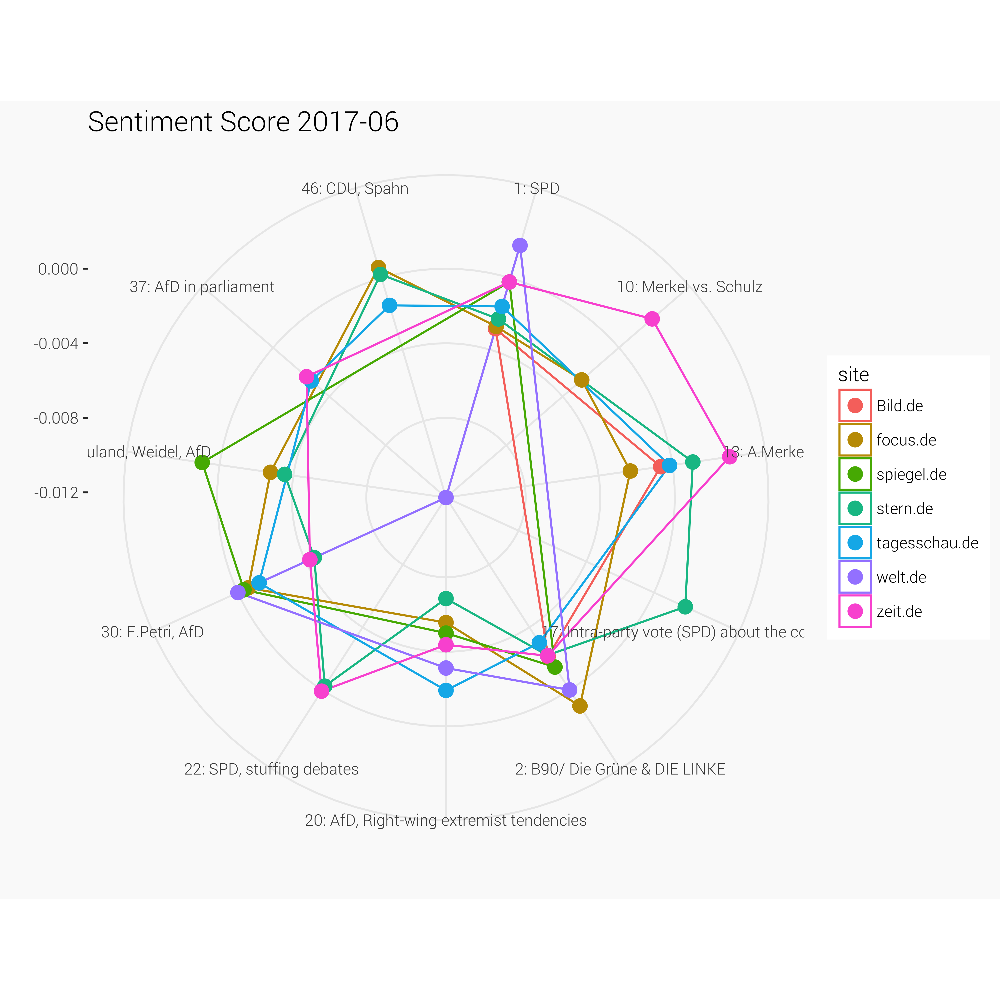 -->
<!-- 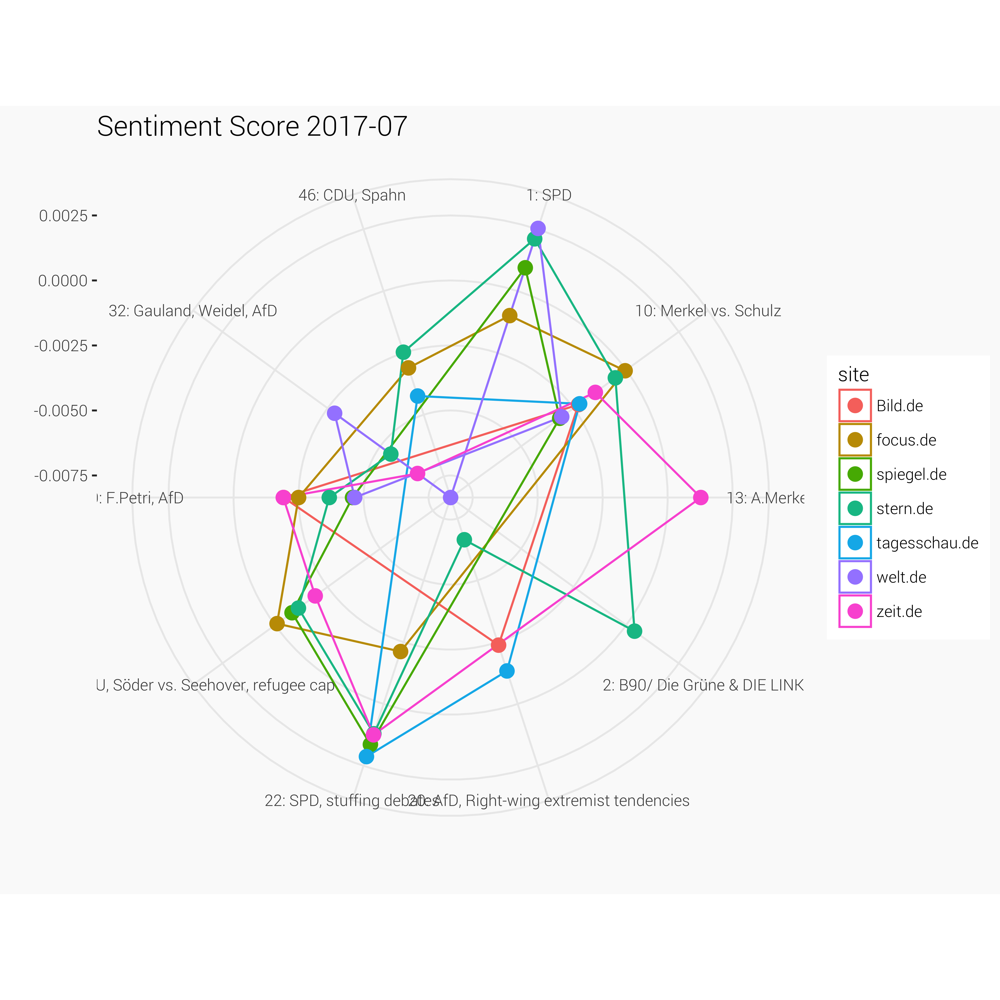 -->
<!-- 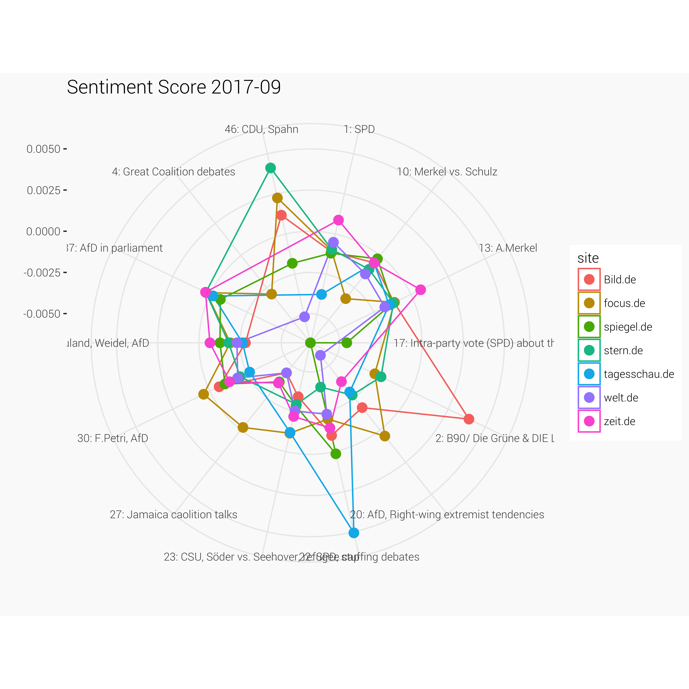 -->
<!-- 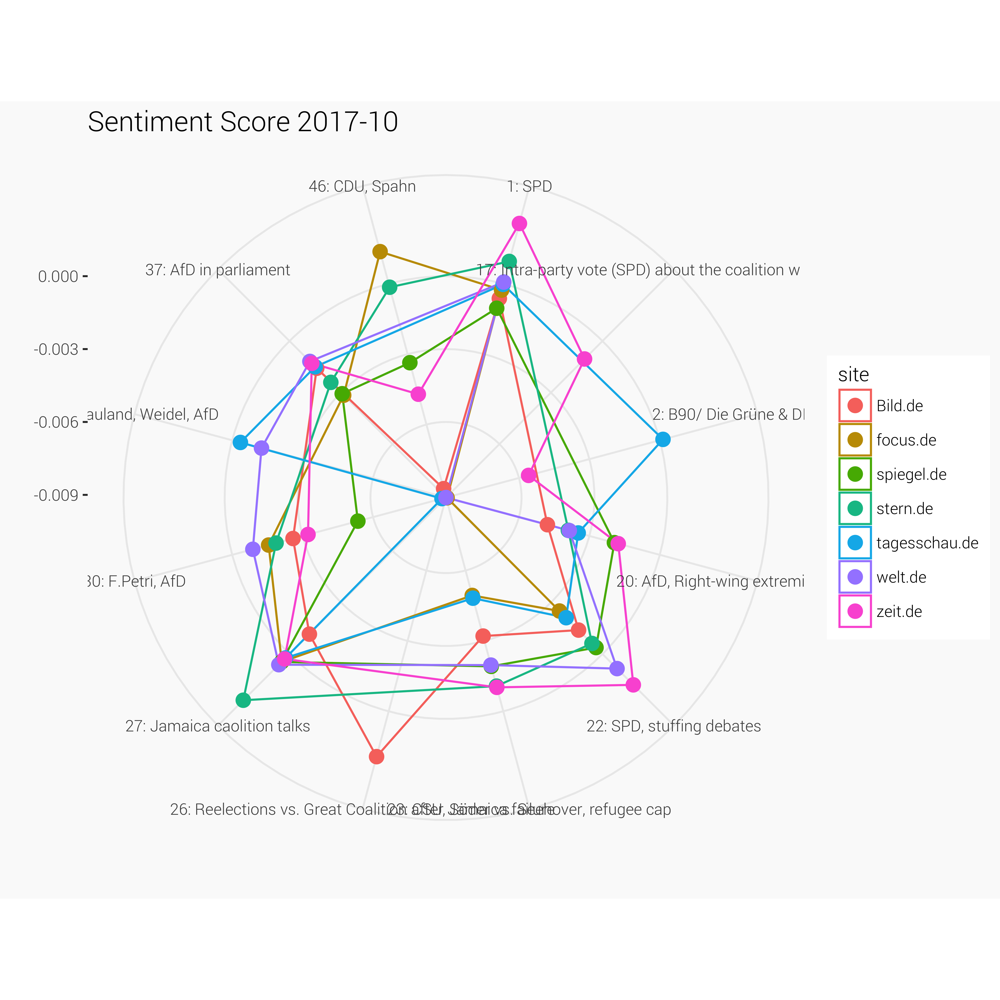 -->
<!-- 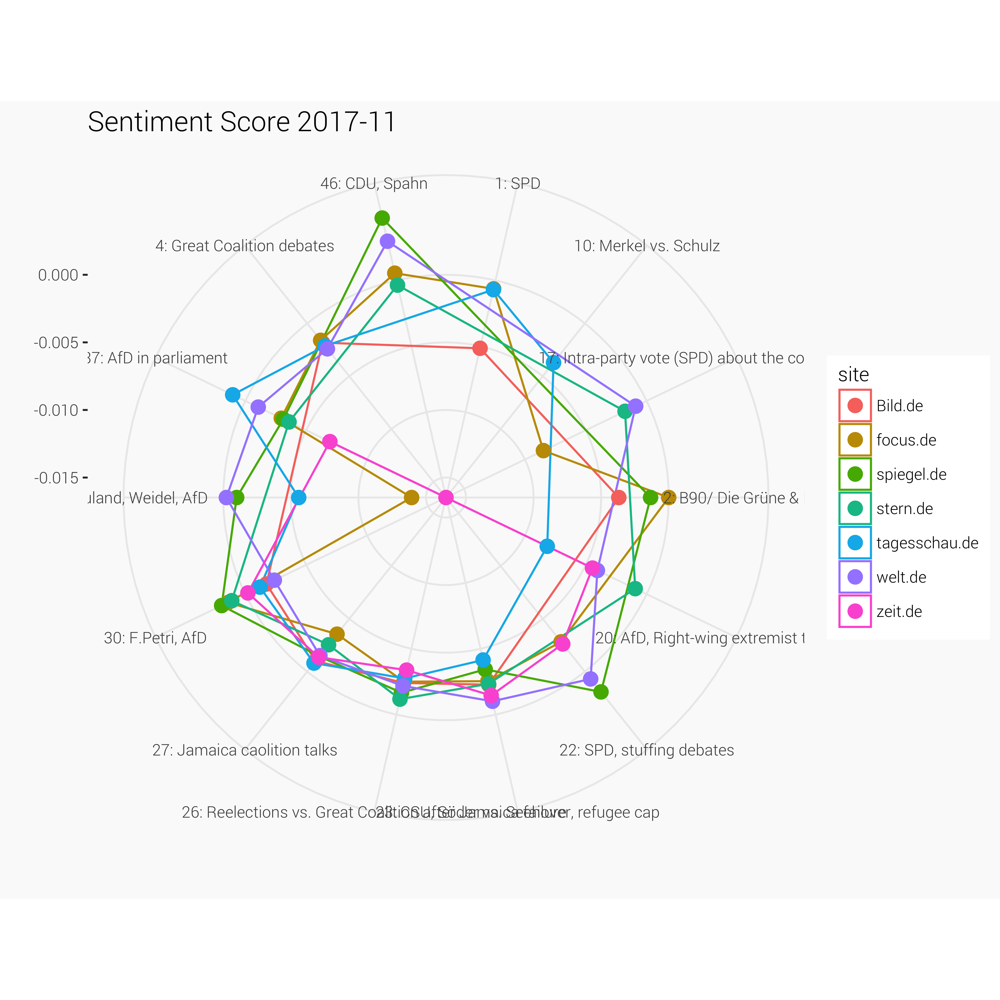 -->
<!-- 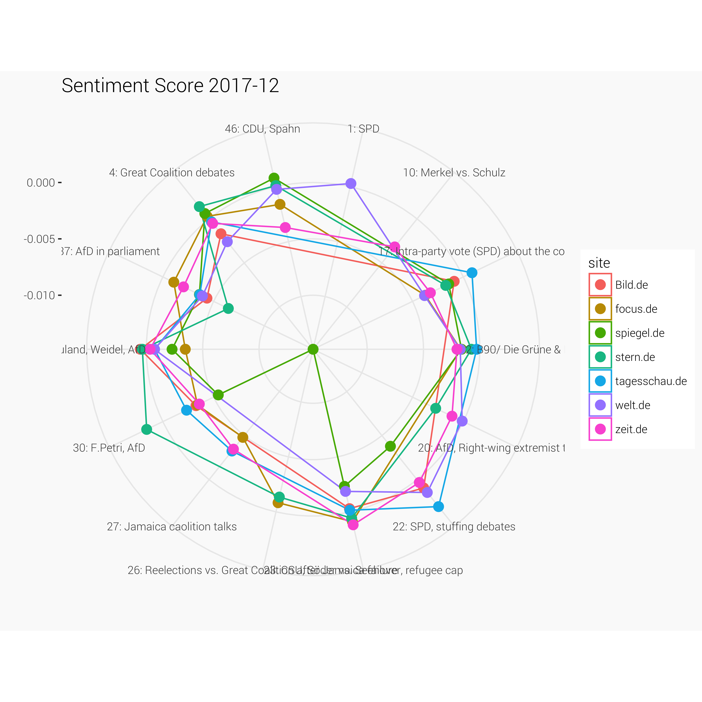 -->
<!-- 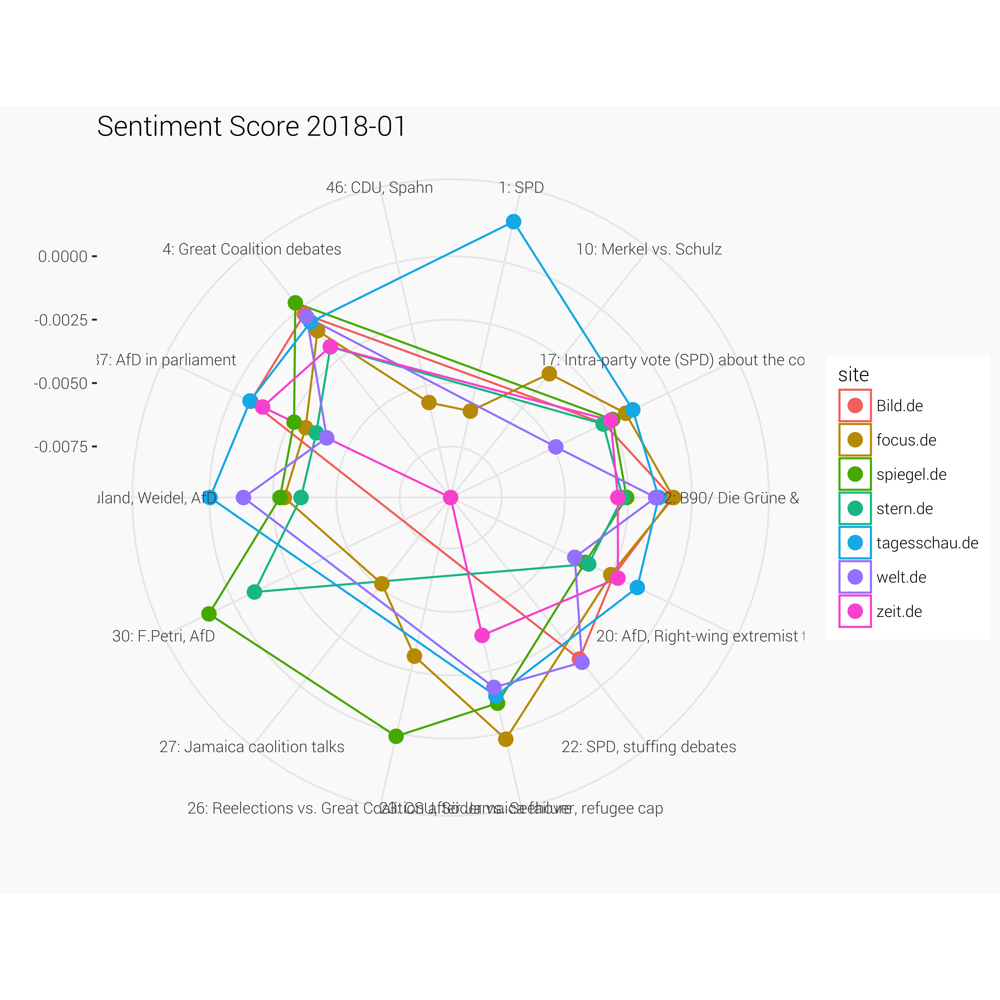 -->
<!-- 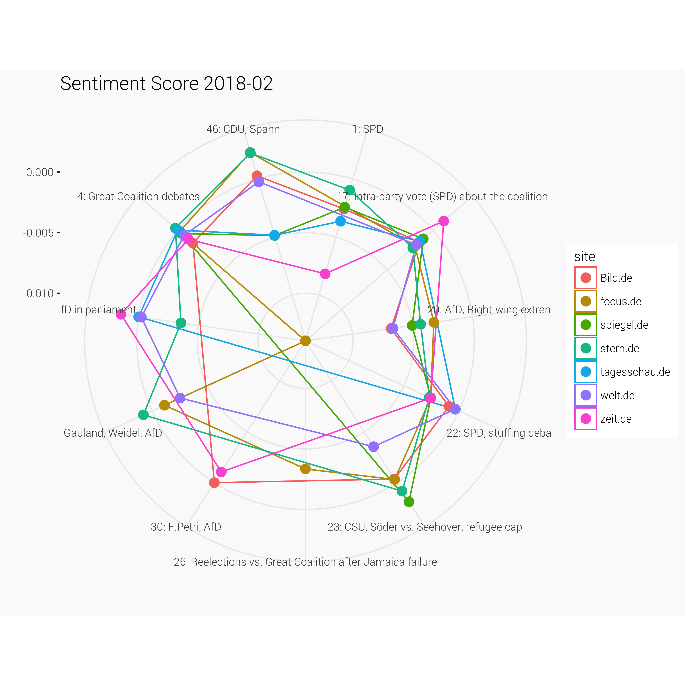 -->

<!-- ### 5. Compare with polls -->

```{r eval=FALSE, include=FALSE}
load("../output/polls.Rda")

htmlTable::htmlTable(table[1:10,], align = "l")
```

<!-- Define Functions  -->

```{r eval=FALSE, include=FALSE}
calculate_month = function(month, year) {
  date <- ymd(paste(year, 1, 1, sep="-"))
  month(date) = month
  return(date)
}

normalize_data <- function(x) {
  y <- (x - min(x, na.rm = T)) / (max(x, na.rm = T) - min(x, na.rm = T))
  return(y)
}
```

<!-- Prepare Dataframes -->

```{r eval=FALSE, include=FALSE}
polls <- table_long %>%
  mutate(month=month(Datum),
         year = year(Datum),
         yearmonth = calculate_month(month,year),
         val_norm = normalize_data(value)) %>%
  group_by(yearmonth,party) %>%
  summarise(mean_val = mean(value, na.rm=T),
            mean_val_norm = mean(val_norm)) %>%
  ungroup() %>%
  filter(mean_val != "NaN") %>%
  select(party, yearmonth, mean_val_norm) %>%
  spread(party, mean_val_norm)
```

```{r eval=FALSE, include=FALSE}
sentDF.values %>%
  mutate(year = year(date),
         month = month(date),
         yearmonth = calculate_month(month,year),
         sentiment_norm = normalize_data(sentiment)) %>%
  group_by(yearmonth, topic_name, topic, site) %>%
  summarise(mean_sent = mean(sentiment, na.rm=T),
            mean_sent_norm = mean(sentiment_norm, na.rm = T)) %>%
  ungroup() %>%
  left_join(polls, by="yearmonth") -> p
```

<!-- Plot  -->

```{r eval=FALSE, include=FALSE}
for (i in unique(p$site)) {
  
  p1 <- p %>%
  filter(site == i) %>%
  ggplot(aes(yearmonth, mean_sent_norm,
               group = site)) +
  geom_point(show.legend = F, color = col[1]) + 
  geom_line(color = col[1]) +

  scale_y_continuous(limits = c(0,1)) +
  scale_x_date(breaks = date_breaks("1 month"), 
               labels = date_format("%b", tz = "CET")) +
  # AfD
  geom_point(aes(yearmonth, AfD), size= 0.5,
             color = "deepskyblue") +
  geom_line(aes(yearmonth, AfD), color = "deepskyblue") +
  
  # CDU/CSU
  geom_point(aes(yearmonth, Union), size= 0.5,
             color = "black") +
  geom_line(aes(yearmonth, Union),
             color = "black") +
  
  # SPD
  geom_point(aes(yearmonth, SPD), size= 0.5,
             color = "red") +
  geom_line(aes(yearmonth, SPD),
             color = "red") +
  
  # Grüne
  geom_point(aes(yearmonth, Grüne), size= 0.5,
             color = "limegreen") +
  geom_line(aes(yearmonth, Grüne),
             color = "limegreen") +
  
  # DIE LINKE
  geom_point(aes(yearmonth, Linke), size= 0.5,
             color = "deeppink") +
  geom_line(aes(yearmonth, Linke),
             color = "deeppink") +
  
  # 
  labs(x="", y="", title=paste(i)) +
    theme(axis.text = element_text(size = 6)) +
  facet_grid(topic_name ~.)
  
  ggsave(p1, file=paste0("../figs/polls_",i,".png"),
         width = 4, height = 10)
  
}
```

<!-- 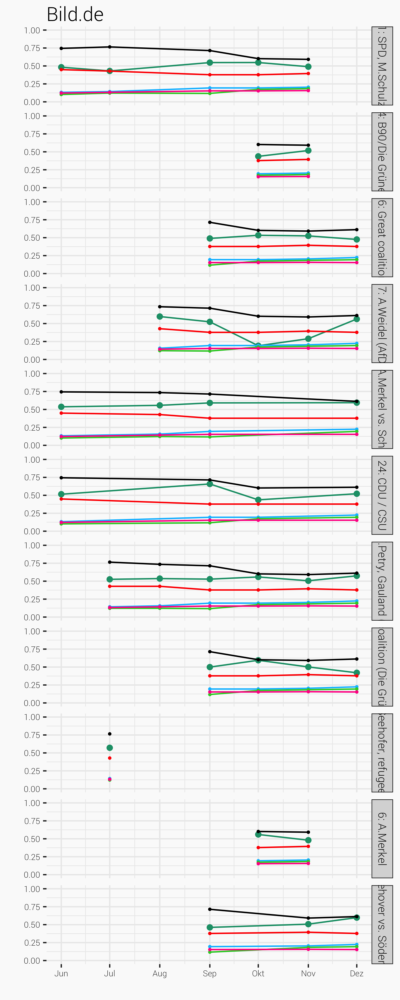 -->
<!--  -->
<!--  -->
<!--  -->
<!-- 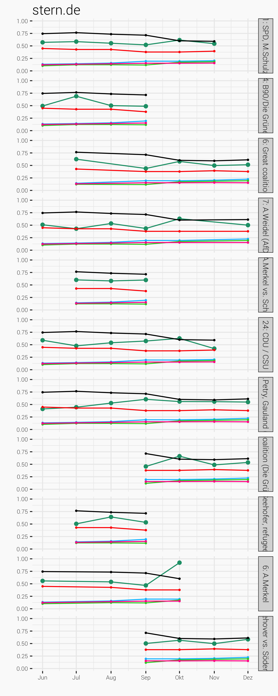 -->
<!-- 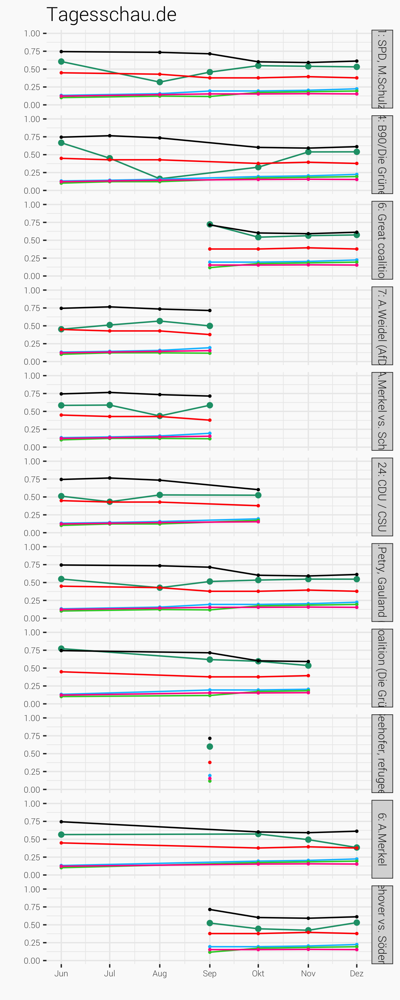 -->
<!--  -->