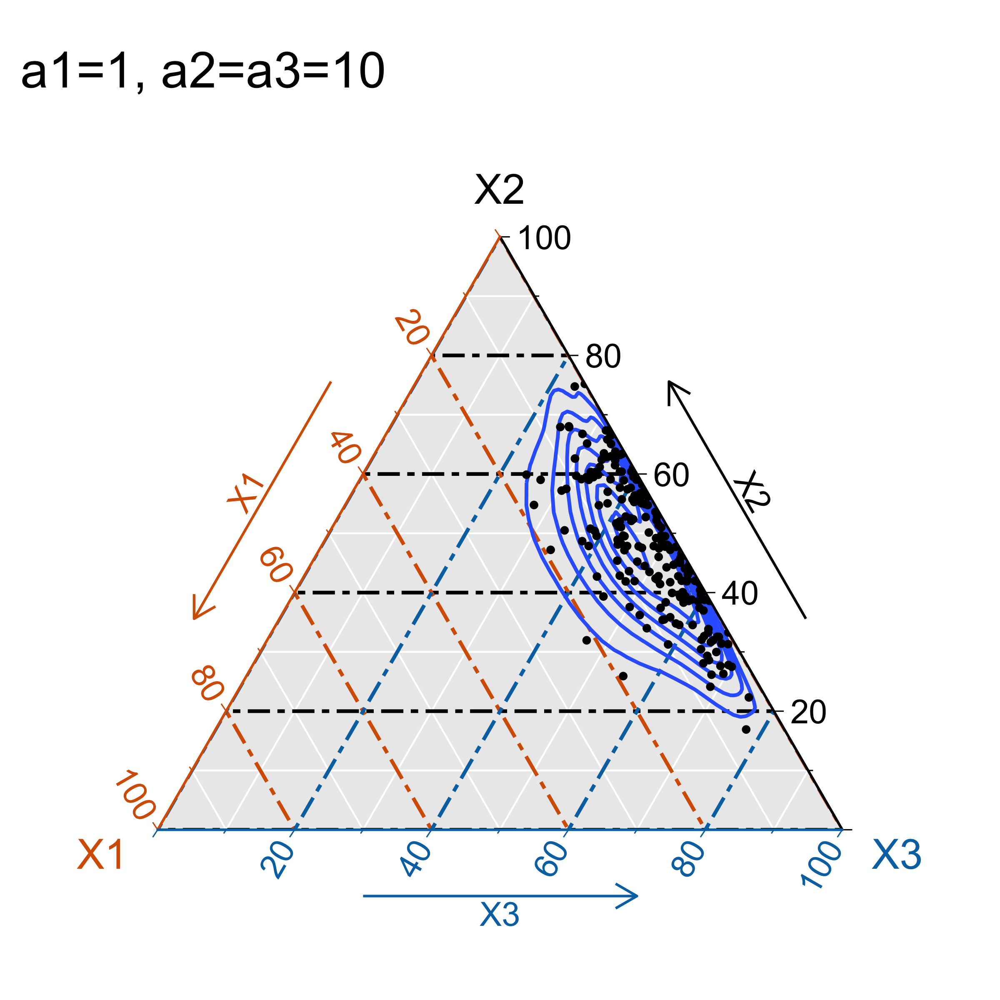
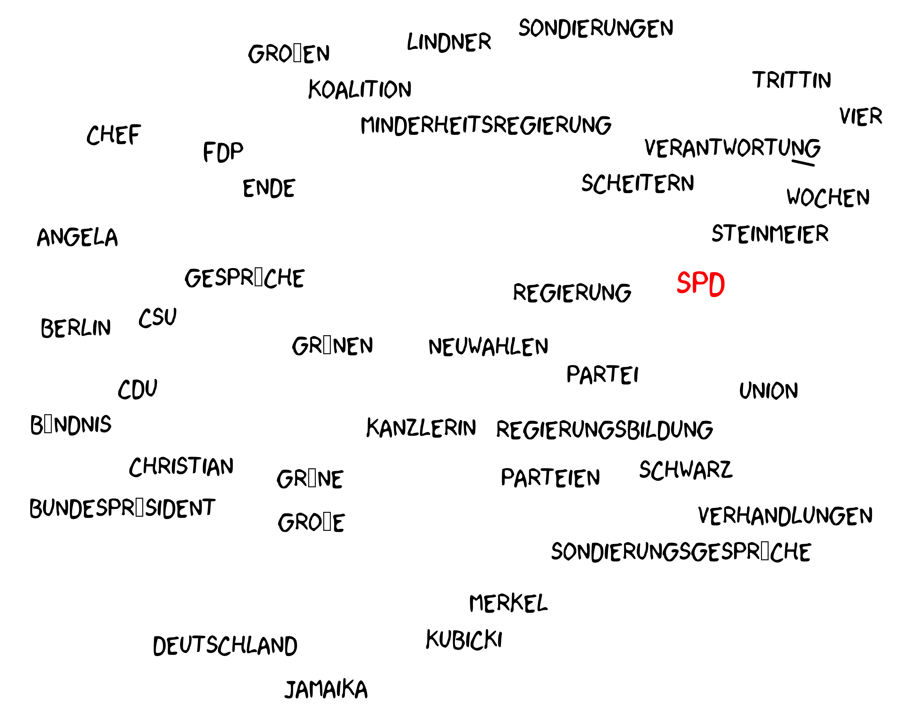

```{r include=FALSE}
suppressPackageStartupMessages({
  library(dplyr)       # Data manipulation
  library(stringr)     # String manipulation
  library(lubridate)   # Date and time manipulation
  library(purrr)       # Functional programming
  library(tidyr)       # Reshaping
  library(magrittr)    # Advanced piping
  library(pushoverr)   # Pushover notifications
  library(doMC)        # Parallel Computing
  library(readr)       # Importing data
  library(tibble)      # Better data frames
  library(data.table)
  library(pscl)
  library(boot)
  library(stm)
  library(tm)
  library(knitr)
  library(readxl)
  library(MCMCpack)
  library(xkcd)
  library(extrafont)

  library(ggplot2)     # Static data visualization
  library(ggpmisc)
  library(ggtern)
  library(RColorBrewer) 
  library(ggrepel)
  library(plotly)
  library(scales)      # Scales
  library(viridis)     # Viridis color scales

  library(tidytext)    # Tidy text mining
  library(stringdist)  # String distances
  library(proxy)       # Distance measures
})

# Theming
quartzFonts(
  Roboto =
    c("Roboto-Light",
      "Roboto-Bold",
      "Roboto-Regular",
      "Roboto-Thin")
)

theme_set(
  theme_bw(base_family = "Roboto", base_size = 8) +
    theme(
      plot.title = element_text(face = "bold", size = 14,
                                margin = margin(0, 0, 4, 0, "pt")),
      plot.subtitle = element_text(size = 12),
      plot.caption = element_text(size = 6, hjust = 0),
      axis.title = element_text(size = 10),
      panel.border = element_blank()
    )
)

rm(list=ls())
col <- brewer.pal(7,"Dark2")
load("data/presentation-data.Rda")
```

## Agenda

1. **Introduction**

2. **Methodology**

4. **First Results**

5. **Whats next**

# Introduction


## Online News

<div style="position:relative; width:900px; height:750px; margin:0 auto;">
  
  
  
  
</div>

## Business Model of online News

<div style="position:relative; width:800px; height:450px; margin:0 auto;">
  
  
</div>

- **Does the business model have an effect on the editorial content?**
- **Methodology:**
  1. Estimate a Structural Topic Model
  2. Use posterior distribution to estimate the effect of document metadata. 

## Data

Online news articles about domestic politics from 01.06.2017 - 01.12.2017


## Concepts

- A single observation in a textual database is called a *document*.

- The set of documents that make up the dataset is called a *corpus*.

- Covariates associated with each document are called *metadata*.

## Data Structure

```{r message=FALSE, warning=FALSE, include=FALSE}
table <- inspect(dtm[1:5,1:10])
```

```{r echo=FALSE}
kable(table)
```

- Documents (articles) are stored on a "Document-Term-Matrix"

- Documents are seen as "bag of words"

- Each article has metadata: publisher (news platform) and the day it was published. 
  
## How to find out latent topics in an article?

# Methodology

## Topic Model


<small>Credits: Christine Doig</small>

## The intuition behind LDA


<small>Credits: Blei (2012)</small>

<aside class="notes">
Model the generation of documents with latent topic structure
(1)a topic ~ a distribution over words
(2)a document ~ a mixture over topics
(3)a word ~ a sample drawn from one topic
Mixed memberhip model: Population of topics stays the same, but distrubution over topics changes for each document.
Each document is comming from a mixture model, where the mixture proportions change from document to document but mixture components are fixed a cross all documents.
</aside>

## LDA as a graphical model


* Nodes are random variables; arrows indicate dependence
* Plates indicate replicated variables:
    * $N =$ collection of words within a document.
    * $D =$ collection of documents within a corpus.

* Shaded nodes are observed; unshaded nodes are hidden
    * observed: word in a document $w_{d,n}$
    * fixed: mixture components (number of topics $K$ & vocabulary)
    * hidden: mixture proportions (per-document topic proportions $\theta_d$ & word-topic distribution $\beta_k$)
    
<aside class="notes">
Diagram:
(1)defines a factorization of the joint probability distribution of hidden and observed random variables.
(2)encodes indepence assumptions about the variables (which variables are dependent and conditionally independent) 
(3)Connects to algorithm for computing with data: Inference problem: finding the hidden variables given the observations.
</aside>
    
## LDA - joint distribution

$$
\begin{aligned}
p(\beta_{1:K},\theta_{1:D},z_{1:D}, w_{1:D}) \propto
\end{aligned}
$$


$$
\begin{aligned}
\displaystyle \prod_{i=1}^{K}p(\beta_i)\displaystyle \prod_{d=1}^{D}p(\theta_d)(\prod_{n=1}^Np(z_{d,n,}|\theta_d)p(w_{d,n}|\beta_{1:K},z_{d,n}))
\end{aligned}
$$


## Generative process

```{r eval=FALSE, include=FALSE}
set.seed(456)

####### 1 
ggsave(plot={
  ggtern(data.frame(rdirichlet(200, c(1,1,1)),
                     alpha = "a1=a2=a3=1"), 
         aes(x = X1, y = X2, z = X3)) + 
  geom_density_tern() +
  geom_point(size=0.5) +
    labs(title="a1=a2=a3=1")+
  ggtern::theme_bvbg() 
},
file="img/dirichlet1.png",
dpi=600,
width = 4,
height = 4
)

######## 2
ggsave(plot={
  ggtern(data.frame(rdirichlet(200, c(10,10,10)),
                     alpha = "a1=a2=a3=10"),
         aes(x = X1, y = X2, z = X3)) + 
  geom_density_tern() +
  geom_point(size=0.5) +
    labs(title="a1=a2=a3=10")+
  ggtern::theme_bvbg() 
},
file="img/dirichlet2.png",
dpi=600,
width = 4,
height = 4
)

########## 3
ggsave(plot={
  ggtern(data.frame(rdirichlet(200, c(1,10,10)),
                     alpha = "a1=1, a2=a3=10"), 
         aes(x = X1, y = X2, z = X3)) + 
  geom_density_tern() +
  geom_point(size=0.5) +
    labs(title="a1=1, a2=a3=10")+
  ggtern::theme_bvbg() 
},
file="img/dirichlet3.png",
dpi=600,
width = 4,
height = 4
)

########### 4
ggsave(plot={
  ggtern(data.frame(rdirichlet(200, c(1,1,10)),
                     alpha = "a1=a2=1, a3=10"), 
         aes(x = X1, y = X2, z = X3)) + 
  geom_density_tern() +
  geom_point(size=0.5) +
    labs(title="a1=a2=1, a3=10")+
  ggtern::theme_bvbg() 
},
file="img/dirichlet4.png",
dpi=600,
width = 4,
height = 4
)
```

* **$K$**: choose the number of topics
   
    * $K=3$
   
* **$\theta_d$**: for each document $d$, choose a distribution over topics;
   
    * $\theta_d$ ~ Dirichlet($\alpha$)
  
  
  <div style="position:relative; width:300px; height:300px; margin:0 auto;">
  
  
  
  
  </div>


* **$z_{d,n}|\theta_d$**: according to $\theta_d$, assign a topic $z_{d,n}$ for the $n^{th}$ word;
      
      * $K=Topic 1$

<aside class="notes">
The higher value of $\alpha_i$, the greater “weight” of $X_i$ and the greater amount of the total “mass” is assigned to it (recall that in total it must be $x_1+⋯+x_k=1$). If all $\alpha_i$ are equal, the distribution is symmetric. If $\alpha_i<1$ it can be thought as anti-weight that pushes away $x_i$ toward extremes, while when it is high, it attracts $x_i$ toward some central value (central in the sense that all points are concentrated around it, not in the sense that it is symmetrically central). 
</aside>

## Generative process (contd.)

* **$w_{d,n}|z_{d,n},\beta,\theta$**: choose a term from that topic according to $\beta_k$
   
    * $\beta_k$ ~ Dirichlet($\eta$)
  
```{r eval=FALSE, include=FALSE}
# Word-topic probabilities
stmOut %>% tidy("beta") %>% filter(!is.na(topic)) -> posts.wtp
# Document-topic probabilities
stmOut %>% tidy("gamma") -> posts.dtp

set.seed(35)
# Label Topics
label <- labelTopics(stmOut, n=40)
terms <- as.data.frame(label$prob, stringsAsFactors = F)

prob <- data.frame(words = t(terms[16,]),
                   value = runif(40,min=0,max=1))

ggsave(plot={
  ggplot(prob, aes(X16,value, label=X16),
       fill = "transparent") +
  geom_text_repel(family = "xkcd",
                  size = 4, seed=5) +
  theme_xkcd() +
  theme(axis.title.x=element_blank(),
        axis.text.x=element_blank(),
        axis.ticks.x=element_blank(),
        axis.title.y =element_blank(),
        axis.text.y =element_blank(),
        axis.ticks.y=element_blank()
        )
},
file = "img/words1.png",
width = 5,
height = 4,
dpi = 600
)

ggsave(plot={
  ggplot(prob[-16,], aes(X16,value, label=X16),
       fill = "transparent") +
  geom_text_repel(family = "xkcd",
                  size = 4, seed=5) +
  geom_text_repel(data=prob[16,], color="red", 
            family = "xkcd", size = 5) +
  theme_xkcd() +
  theme(axis.title.x=element_blank(),
        axis.text.x=element_blank(),
        axis.ticks.x=element_blank(),
        axis.title.y =element_blank(),
        axis.text.y =element_blank(),
        axis.ticks.y=element_blank()
        )
},
file = "img/words2.png",
width = 5,
height = 4,
dpi = 600
)
```

<div style="position:relative; width:500px; height:400px; margin:0 auto;">
  
  
</div>


* **$N$**: repead this process for all $n$ word-positions in the document.

* **$D$**: conduct this process for all $d$ documents in the corpus

## Research Process


<aside class="notes">
(1)We have knowledge about the world and want to answer a specific question: We know that newspapers are based on different business models. does that have an effect on the topics discussed in the newspaper?
(2)We make assumptions and bring them together with our data to uncover patterns.
(3)We use these patterns (posterior distributions) to predict a variable
</aside>

## Strucutral Topic Model (Roberts et. al. (2016))

- Including covariates into a topic model:

<aside class="notes">
(1)to estimate the impact of document-level covariates on topic content and prevalence as part of the topic model itself.
(2)We want to use estimates of $\theta_d$ as the dependent variable in an regression on covariates to test whether different types of documents have different content.
(2)This is contradictory because documents are assumed to be generated by the same statistical process.
</aside>

  1. **Topic Prevalence**: Attributes that affect the likelihood of discussing topic $k$
        
        News platform & the month the article was published.

  2. **Topic Content**: Attributes that affect the likelihood of including term $w$ overall, and of including it within topic $k$
          
        Not yet included.

<div style="position:relative; width:850px; height:490px; margin:0 auto;">
  
  
  
  
</div>

<aside class="notes">
(3)Diagram:
$X$= Matrix of topic prevalence covariates, dimension: DxP
$Y$= Matrix of topical content covariates, dimension: DxA
$m$= marginal log-frequency of term $v$ (estimated from total counts)

- The process for generating individual words is the same as for plain LDA conditional on the $\beta_k$ and $\theta_d$ terms.
(3.1)Diagram: can be divided into three components
(a)topic prevalence model: which controls how words are allocated to topics as a function of covariates
(b)topical contnet model: which controls the frequency of terms in each topic as a function of covariates
(c)core language (or observation) model, which combines these two sources of variation to produce the actual words in each document.
</aside>

## STM Priors

<div style="position:relative; width:600px; height:350px; margin:0 auto;">
  
</div>  

## Bayesian inference

Posterior probability:

$$
\begin{aligned}
p(\eta,z,\kappa,\gamma,\Sigma|w,X,Y) \propto
\displaystyle \prod_{d=1}^{D}(\eta_d|X_d\gamma,\Sigma) (\displaystyle \prod_{n=1}^{D}(z_{n,d}|\theta_d)*(w_n|\beta_{d,k=z_{d,n}}))) * \displaystyle \prod p(\kappa)\displaystyle \prod p(\Gamma)
\end{aligned}
$$


* The number of possible topic structures is exponentially large --> sum is intractable to compute.
* Instead of obtaining a closed-form solution for the posterior distribution, we must approximate it.

<aside class="notes">
the joint distribution defines a posterior. 
In theory, it can be computed by summing the joint distribution over every possible instantiation of the hidden topic structure.
$p(\theta,z,\beta|w)$ the probability of the hidden structures given the observed words in a document.
That number of possible topic structures, however, is exponentially large; this sum is intractable to compute. As for many modern probabilistic models of interest—and for much of modern Bayesian statistics—we cannot compute the posterior because of the denominator, which is known as the evidence. A central research goal of modern probabilistic modeling is to develop efficient methods for approximating it. Topic modeling algorithms—like the algorithms are often adaptations of general-purpose methods for approximating the posterior distribution.
First uncover the structure (calculate th posterior) - use the discovered distributions to perform task
</aside>

## Approximate Posterior


Central research goal of probabilistic modeling: develop efficient methods for approximating posterior.

* Mean field variational methods (Blei et al., 2001, 2003)
* Expectation propagation (Minka and Lafferty, 2002)
* Collapsed Gibbs sampling (Griffiths and Steyvers, 2002)
* Distributed samplung (Newsman et al., 2008; Ahmed et al., 2012)
* Stochastic inference (Hoffman et al., 2010, 2013; Mimno et al., 2012)
* Factorization inference (Arora et al., 2012; Anandkumar et al., 2012)
* **Variational EM algorithm** (Wang and Blei 2013; Roberts et. al. (2016)
* ...
    
<aside class="notes">
the answers the estimation procedure comes up with may depend on starting values of the parameters (e.g., the distribution over words for a particular topic).
</aside>
  
## Model Selection


**Prior Specification:**

$\gamma_{p,k}$ ~ Normal$(0,\sigma^2_k)$

$\sigma^2_k$ ~ Inverse-Gamma$(a,b)$

<aside class="notes">
The prior specification for the topic prevalence parameters is a zero mena Haussian distribution with shared variance parameter.
$p$ indexes the covariates, $k$ indexes the topics and $a,b$ are fixed hyperparameters
</aside>

**Topic Selection:**

$K=28$

<aside class="notes">
(2)Two potential goals:
(2a)Predict text well. Statistical criteria to select $K$.
(2b)Interpretability. General versus specific.
</aside>

# Model Results

```{r include=FALSE}
# Word-topic probabilities
stmOut %>% tidy("beta") %>% filter(!is.na(topic)) -> posts.wtp
# Document-topic probabilities
stmOut %>% tidy("gamma") -> posts.dtp

# Label Topics
label <- labelTopics(stmOut, n=3)

prob <- as.data.frame(label$prob, stringsAsFactors = F)
frex <- as.data.frame(label$frex, stringsAsFactors = F)
lift <- as.data.frame(label$lift, stringsAsFactors = F)
score <- as.data.frame(label$score, stringsAsFactors = F)

topicLabel <- prob %>% 
  transmute(topic = rownames(.),
            topic_name = paste(prob$V1,prob$V2,prob$V3,score$V1,score$V2,score$V3, sep=","),
            prob = paste(prob$V1,prob$V2,prob$V3, sep=","),
            frex = paste(frex$V1,frex$V2,frex$V3, sep=","),
            lift = paste(lift$V1,lift$V2,lift$V3, sep=","),
            score = paste(score$V1,score$V2,score$V3, sep=",")) 

topicLabel$topic_name <- vapply(lapply(strsplit(topicLabel$topic_name, ","), unique), paste, character(1L), collapse = " ")
rm(prob, frex, lift, score)

top_topics <-
  posts.dtp %>% 
  group_by(document) %>%
  mutate(therank = rank(-gamma, ties.method = "random")) %>%
  filter(therank %in% 1) %>%
  select(- therank)

# Add Topic to origian DF
btw %>%
  mutate(document = articleID) %>%
  inner_join(.,top_topics, by="document") %>%
  ## Combine with Topic label
  left_join(., topicLabel %>%
              select(topic_name, topic) %>%
              mutate(topic = as.numeric(topic)), by="topic") -> btw

topic_sample <- c(1,5,6,7,9,16,19,24)
```

## Topic Proportions

```{r echo=FALSE, fig.height=6.5}
plot(stmOut, type = "summary", xlim = c(0,.16), n = 5, 
     custom.labels = topicLabel$topic_name, 
     family = "Roboto", main = "", text.cex = 1)
```

## Timeline
```{r Data for topic trends chart, message=FALSE, warning=FALSE, include=FALSE}
set.seed(7292)
btw %>% 
  filter(gamma>=0.5) %>%
  mutate(date = as.POSIXct(date),
         allocation = 1) %>%
  mutate(post_period = 
           date %>% with_tz("Europe/Paris") %>% 
           floor_date("week")) %>%
  # Summarise into tidy dataframe
  group_by(post_period, topic, topic_name) %>% dplyr::summarise(articles = sum(allocation)) %>%
  # Mark peaks 
  group_by(topic_name) %>% dplyr::mutate(peak = ifelse(articles==max(articles),1,0)) -> chart_topic_trends.dt
```

```{r echo=FALSE, fig.width=10, message=FALSE, warning=FALSE}
ggplot(chart_topic_trends.dt, 
       aes(post_period, articles, color=topic_name)) +
  geom_line() +
  scale_color_manual(
            values = rainbow(28) %>% 
              adjustcolor(red.f = 0.6, green.f = 0.6, blue.f = 0.6)
          ) +
  geom_text_repel(data=subset(chart_topic_trends.dt,peak==1 & topic %in% topic_sample),
            aes(post_period,articles,label=paste(topic,topic_name,sep=":")),
            size=4) +
      geom_vline(aes(xintercept=as.POSIXct("2017-09-23")),
                 linetype = 2, color="grey20") +
      geom_vline(aes(xintercept=as.POSIXct("2017-11-19")),
                 linetype = 2, color="grey20") +
  ylim(c(0,200)) +
  labs(y="Number of Articles") +
    theme(
      legend.position   = "none",
      plot.background   = element_rect("#fafafa", "#fafafa"),
      plot.title        = element_text(size = 18),
      plot.subtitle     = element_text(size = 8),
      plot.caption      = element_text(size = 7),
      panel.grid        = element_blank(),
      panel.background  = element_rect("#fafafa"),
      axis.title.x      = element_blank(),
      axis.text.y       = element_text(size = 8)
    )
```

## Sample Articles

```{r Document classification, echo=FALSE}
set.seed(9272)

posts_classification.sdt <-
  btw %>%
  filter(topic %in% topic_sample) %>%
  mutate(topic_title = 
           paste0("Topic ", formatC(topic, flag = "0", width = 2), 
                  " - ", topic_name)) %>%
  group_by(topic_name) %>% 
  top_n(100, gamma) %>%
  sample_n(3) %>%
  arrange(topic)

kable(posts_classification.sdt[1:12,c("topic_title","title")])
```

## Sample Articles (contd)

```{r echo=FALSE}
kable(posts_classification.sdt[13:24,c("topic_title","title")])
```


## Estimate Effect of Covariates

Estimate the conditional expectation of topic prevalence for given document characteristics (lm on compositional data):

$$
\theta_d=\alpha+\beta_1 x_{site}+\beta_2x_{month}+\epsilon
$$

<div style="position:relative; width:500px; height:500px; margin:0 auto;">
  
  
  
  
  
  
  
  
</div>

<aside class="notes">
The stm-package provides a function that uses the method of composition to incorporates uncertainty in the dependent variable, drawing a set of topic proportions from the variational posterior repeated times and compute the coefficients as the average over all results. 
</aside>

# Whats next?

## Whats next?

1. **Estimate model, including the effect of covariates on topical content** How are topics discused within different newswires?

2. **Relationship between topics** How topics are correlated differently for different newswires, indicating how topics are connected and framed differently in each newswire.

