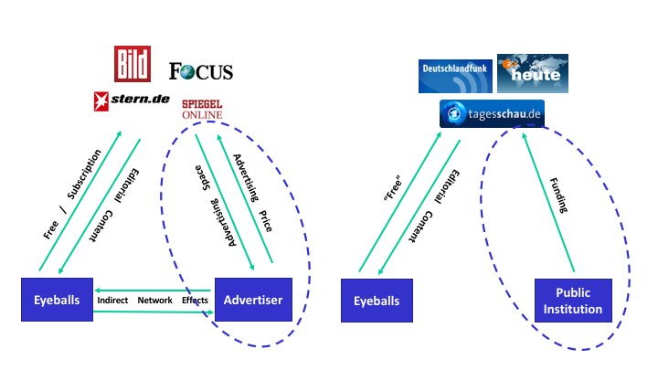

## Agenda

1. **Introduction**

2. **Methodology**

3. **Literature Review**

4. **First Results**

5. **Conclusion**

# Introduction
## Online News

  
  
  
  

## Business Model of online News

---------------------------

### Research Question: 
Does the business model have an effect on the editorial content?

### Methodology: 
  1. Estimate a Structural Topic Model
  2. Use posterior distribution to estimate the effect of document metadata. 

## Data
Online news articles about domestic politics from 01.06.2017 - 22.11.2017

## Concepts

- A single observation in a textual database is called a *document*.

- The set of documents that make up the dataset is called a *corpus*.

- Covariates associated with each document are called *metadata*.

## Data Structure

