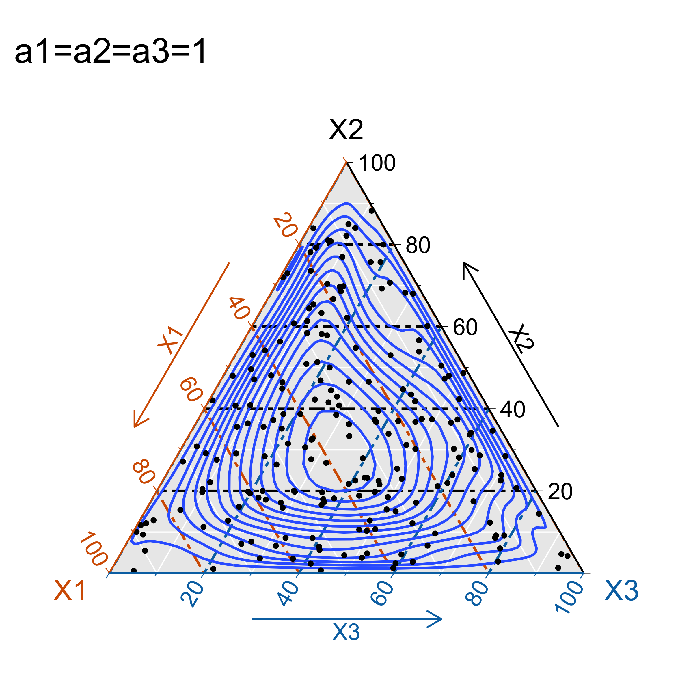
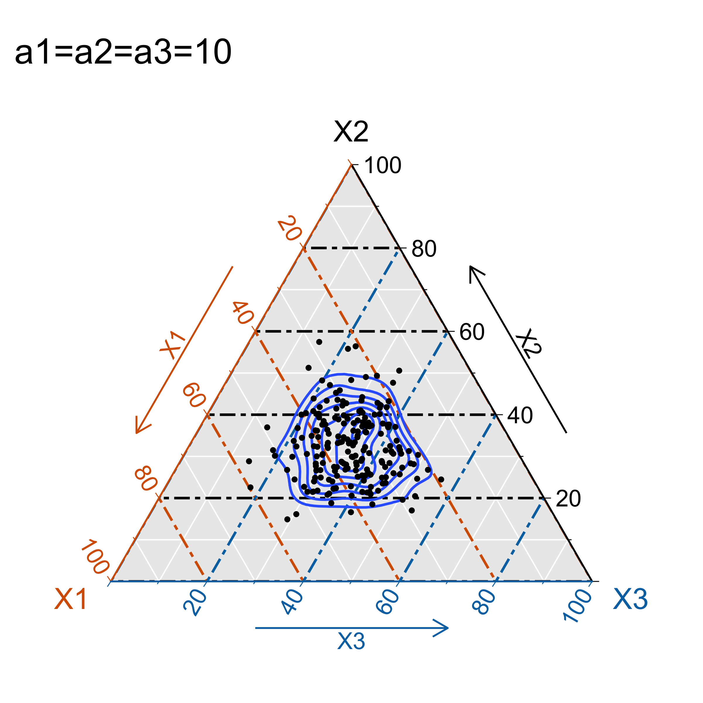
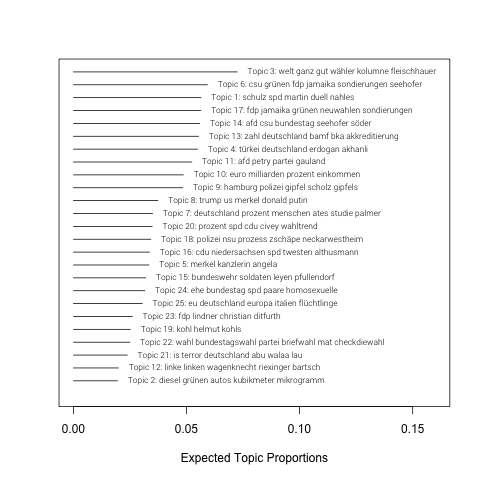

Whats inside the news?
========================================================
author: Franziska Löw
date: 
incremental: true

Agenda
========================================================
type: prompt

1. **Introduction**

2. **Methodology**

3. **Literature Review**

4. **First Results**

5. **Conclusion**

Introduction
========================================================
type: section

Online News
========================================================
type: prompt

  
  
  
  

Business Model of online News
========================================================
type: prompt

  
  

### Does the business model have an effect on the editorial content?

### Methodology: 
  1. Estimate a Structural Topic Model
  2. Use posterior distribution to estimate the effect of document metadata. 

Data
========================================================
type: prompt

Online news articles about domestic politics from 01.06.2017 - 22.11.2017

Concepts
========================================================
type: prompt

- A single observation in a textual database is called a *document*.

- The set of documents that make up the dataset is called a *corpus*.

- Covariates associated with each document are called *metadata*.

Data Structure
========================================================
type: prompt

|     | afd| beruf| funktion| helmut| jahre| kohl| merkel| prozent|
|:----|---:|-----:|--------:|------:|-----:|----:|------:|-------:|
|4214 |   2|     0|        0|      0|     4|    0|    106|      13|
|5412 | 137|    69|       69|      0|    78|    0|      3|       3|
|5442 | 134|     0|        0|      0|     4|    0|     59|      88|
|582  |   0|     0|        0|    144|    28|  235|      3|       1|
|6282 | 206|    94|       94|      0|   104|    0|      5|       2|

- Documents (articles) are stored on a "Document-Term-Matrix"
- Documents are seen as "bag of words"
- Each article has metadata: publisher (news platform) and the day it was published. 
  
## How to find out latent topics in an article?

Methodology
========================================================
type: section

Topic Model
========================================================
type: prompt

<small>Credits: Christine Doig</small>

The intuition behind LDA
========================================================
type: prompt

<small>Credits: Blei (2012)</small>

<aside class="notes">
Model the generation of documents with latent topic structure
(1)a topic ~ a distribution over words
(2)a document ~ a mixture over topics
(3)a word ~ a sample drawn from one topic
Mixed memberhip model: Population of topics stays the same, but distrubution over topics changes for each document.
Each document is comming from a mixture model, where the mixture proportions change from document to document but mixture components are fixed a cross all documents.
</aside>

LDA as a graphical model
========================================================
type: prompt
autosize: true

* Nodes are random variables; arrows indicate dependence
* Plates indicate replicated variables:
    * $N =$ collection of words within a document.
    * $D =$ collection of documents within a corpus.

* Shaded nodes are observed; unshaded nodes are hidden
    * observed: word in a document $w_{d,n}$
    * fixed: mixture components (number of topics $K$ & vocabulary)
    * hidden: mixture proportions (per-document topic proportions $\theta_d$ & word-topic distribution $\beta_k$)
    
<aside class="notes">
Diagram:
(1)defines a factorization of the joint probability distribution of hidden and observed random variables.
(2)encodes indepence assumptions about the variables (which variables are dependent and conditionally independent) 
(3)Connects to algorithm for computing with data: Inference problem: finding the hidden variables given the observations.
</aside>
    
LDA - joint distribution
========================================================
type: prompt
autosize: true
    
$$
\begin{aligned}
p(\beta_{1:K},\theta_{1:D},z_{1:D}, w_{1:D})=
\end{aligned}
$$
$$
\begin{aligned}
\displaystyle \prod_{i=1}^{K}p(\beta_i)\displaystyle \prod_{d=1}^{D}p(\theta_d)(\prod_{n=1}^Np(z_{d,n,}|\theta_d)p(w_{d,n}|\beta_{1:K},z_{d,n}))
\end{aligned}
$$

Generative process
========================================================
type: prompt

* **$K$**: choose the number of topics
   
   $K=3$
* **$\theta_d$**: for each document $d$, choose a distribution over topics;
   
   $\theta_d$ ~ Dirichlet($\alpha$)
  
  
  

  
  
  
  
  

* **$z_{d,n}|\theta_d$**: according to $\theta_d$, assign a topic $z_{d,n}$ for the $n^{th}$ word;
      E.g.$K=1$

<aside class="notes">
The higher value of $\alpha_i$, the greater “weight” of $X_i$ and the greater amount of the total “mass” is assigned to it (recall that in total it must be $x_1+⋯+x_k=1$). If all $\alpha_i$ are equal, the distribution is symmetric. If $\alpha_i<1$ it can be thought as anti-weight that pushes away $x_i$ toward extremes, while when it is high, it attracts $x_i$ toward some central value (central in the sense that all points are concentrated around it, not in the sense that it is symmetrically central). 
</aside>

Generative process (contd.)
========================================================
type: prompt

* **$w_{d,n}|z_{d,n},\beta,\theta$**: choose a term from that topic according to $\beta_k$
   
   $\beta_k$ ~ Dirichlet($\eta$)
  

  

* **$N$**: repead this process for all $n$ word-positions in the document.
* **$D$**: conduct this process for all $d$ documents in the corpus

Bayesian inference
========================================================
type: prompt

Posterior probability: 
$$
\begin{aligned}
P(A|B)=\frac{P(B|A)P(A)}{P(B)}
\end{aligned}
$$

$$
\begin{aligned}
p(\theta_{1:D},z_{1:D},\beta_{1:K}|w_{1:D}) = \frac{p(\theta_{1:D},\beta_{1:K},z_{1:D})(w_{1:D})}{p(w_{1:D})}
\end{aligned}
$$
  
* **numerator**: joint distribution of all random variables 
* **denominator**: marginal probability of the observations (probability of seeing the observed corpus under any topic model.)

* number of possible topic structures is exponentially large; this sum is intractable to compute.
* Instead of obtaining a closed-form solution for the posterior distribution, we must approximate it.
* Central research goal of probabilistic modeling: develop efficient methods for approximating posterior.

<aside class="notes">
the joint distribution defines a posterior. 
In theory, it can be computed by summing the joint distribution over every possible instantiation of the hidden topic structure.
$p(\theta,z,\beta|w)$ the probability of the hidden structures given the observed words in a document.
That number of possible topic structures, however, is exponentially large; this sum is intractable to compute. As for many modern probabilistic models of interest—and for much of modern Bayesian statistics—we cannot compute the posterior because of the denominator, which is known as the evidence. A central research goal of modern probabilistic modeling is to develop efficient methods for approximating it. Topic modeling algorithms—like the algorithms are often adaptations of general-purpose methods for approximating the posterior distribution.
First uncover the structure (calculate th posterior) - use the discovered distributions to perform task
</aside>

Approximate Posterior
========================================================
type: prompt

- Mean field variational methods (Blei et al., 2001, 2003)
- Expectation propagation (Minka and Lafferty, 2002)
- Collapsed Gibbs sampling (Griffiths and Steyvers, 2002)
- Distributed samplung (Newsman et al., 2008; Ahmed et al., 2012)
- Stochastic inference (Hoffman et al., 2010, 2013; Mimno et al., 2012)
- Factorization inference (Arora et al., 2012; Anandkumar et al., 2012)
- Amortized inference (Srivastava and Sutton, 2019)
- ...

Research Process
========================================================
type: prompt

<aside class="notes">
  1. We have knowledge about the world and want to answer a specific question: We know that newspapers are based on different business models. does that have an effect on the topics discussed in the newspaper?
  2. We make assumptions and bring them together with our data to uncover patterns.
  3. We use these patterns (posterior distributions) to predict a variable
</aside>

Strucutral Topic Model
========================================================
type: prompt

- The structural topic model (STM) of Roberts et. al. (2016) explicitly introduces covariates into a topic model, and allows one to estimate the impact of document-level covariates on topic content and prevalence as part of the topic model itself.

  

<aside class="notes">
Diagram:
(1)We want to use estimates of $\theta_d$ as the dependent variable in an regression on covariates to test whether different types of documents have different content.
(2)This is contradictory because documents are assumed to be generated by the same statistical process.
</aside>

Strucutral Topic Model (contd.)
========================================================
type: prompt

- The process for generating individual words is the same as for plain LDA conditional on the $\beta_k$ and $\theta_d$ terms.

- However both objects can depend on potentially different sets of document- level covariates. Each document has:
    1. **Topic Prevalence**: Attributes that affect the likelihood of discussing topic $k$
    2. **Topic Content**: Attributes that affect the likelihood of including term $w$ overall, and of including it within topic $k$
    
- The generation of the $\beta_k$ and $\theta_k$ terms is via multinomial logistic regression, which breaks local conjugacy.

Model Selection
========================================================
type: prompt

- There are three parameters we need to make assumptions about: number of topics $K$ and priors $\alpha, \eta$:
  - Priors don’t receive too much attention in literature: 
      - Griffiths & Steyvers (2002) recommend $\eta = 200/N$ and $\alpha = 50/K$. 
      - Smaller values will tend to generate more concentrated distributions. (See also Wallach et.al. (2009)).
  - $K$ is clearer. Two potential goals:
     1. Predict text well. Statistical criteria to select $K$.
      2. Interpretability. General versus specific.

Formalizing Interpretability
========================================================
type: prompt

- Chang et. al. (2009) propose an objective way of determining whether topics are indeed interpretable.
- Two tests:
  1. *Word intrusion*:
      - Form set of words consisting of top five words from topic k + word with low probability in topic k. 
      - Ask subjects to identify inserted word.
  2. *Topic intrusion*: 
      - Show subjects a snippet of a document + top three topics associated to it + randomly drawn other topic. 
      - Ask to identify inserted topic.
      

Model Results
========================================================
type: section

Topic Proportions
========================================================
type: prompt

Sample Articles
========================================================
type: prompt
