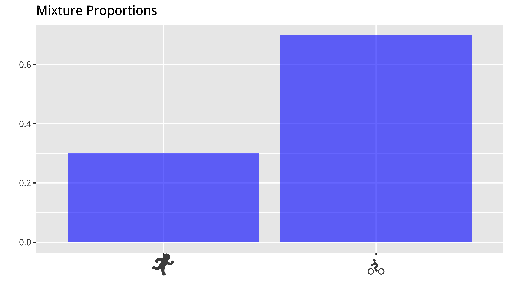
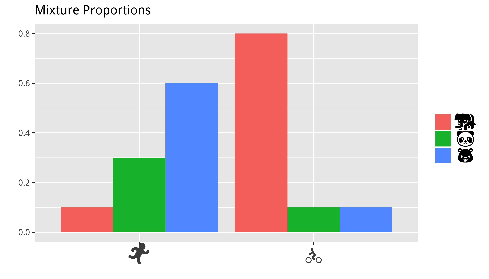

```{r echo=TRUE, message=FALSE, warning=FALSE}
library(dplyr)
library(ggplot2)
library(MCMCpack)
library(Compositional)
library(data.table)
#library(utf8)
#library(emojifont)
#library(htmlTable)
```

**This is basically a R-version of [Timothy Hoppers](https://github.com/tdhopper/pydata-nyc-2015) presentation.

```{r}
data("iris")
set.seed(1235)

df <- as.data.frame(iris)
```

# Naive Clustering

Can we discriminate between Setosa and Virginica irises by modeling their sepal length as a mixture of Gaussians?
```{r}
df %>%
  filter(!Species == "versicolor") -> df

ggplot(df, aes(Sepal.Length)) +
  geom_histogram(fill="blue", alpha=.5, bins = 10) +
  labs(x="", y="", title="Sepal Length for Iris-Setosa and Iris-Virginica")
```

# Naive Clustering
```{r}
ggplot(df, aes(Sepal.Length)) +
  geom_histogram(fill="blue", alpha=.5, bins = 10) +
  geom_vline(aes(xintercept=5.8)) +
  labs(x="", y="", title="Sepal Length for Iris-Setosa and Iris-Virginica")
```

# Gaussian Mixture Models
Here's what our actual underlying data looks like.
Without knowing the latent classes, we could assume that each class is drawn from a normal distribution.
```{r}
ggplot(df, aes(Sepal.Length, fill=factor(Species))) +
  geom_histogram(alpha=.5, bins = 10) +
  labs(x="", y="", title="Sepal Length for Iris-Setosa and Iris-Virginica") +
  theme(legend.position = "none")
```

# Sampling
```{r echo=FALSE, message=FALSE, warning=FALSE}
mixture_proportions = c(0.5,0.5)
mixture_proportions = c(0.5,0.5)
mean = c(5.01,6.59)
std = c(0.35,0.64)

i = 100
data = data.frame(iris_type=rep(0,i), 
                  sepal_length=rep(0,i))

for (i in 1:i) {
  iris_type = sample(c(1,2),1,prob=mixture_proportions)
  sepal_length = rnorm(1,mean = mean[iris_type], sd= std[iris_type])
  
  data[i,] = c(iris_type,sepal_length)
}

ggplot(data, aes(sepal_length, fill=factor(iris_type))) +
  geom_histogram(alpha=.6, bins=10) +
  labs(x="", y="",
    title="Simulated Sepal Length for Iris-Setosa and Iris-Virginica") +
  theme(legend.position = "none")
```

# Insert uncertainty

Instead of fixed parameters, we could also sample parameters from probability distributions.

## What is a Dirichlet Distribution?
Continuous distribution over unit vectors.
Each sample is often regarded as a probability distribution; i.e. this is a distribution of distributions.
In our example problem, the sample from the Dirichlet distribution determines the relative number of data points for each flower type.

```{r}
rdirichlet(10, c(1,1,2))
```

The higher value of $\alpha_i$, the greater “weight” of $X_i$ and the greater amount of the total “mass” is assigned to it (recall that in total it must be $x_1+⋯+x_k=1$). If all $\alpha_i$ are equal, the distribution is symmetric. If $\alpha_i<1$ it can be thought as anti-weight that pushes away $x_i$ toward extremes, while when it is high, it attracts $x_i$ toward some central value (central in the sense that all points are concentrated around it, not in the sense that it is symmetrically central). 

If $\alpha_1=\alpha_2=\alpha_3=1$ then the points are uniformly distributed:

```{r}
bivt.contour(rdirichlet(100, c(1,1,1)))
```

$\alpha_1=\alpha_2=\alpha_3=.1$ 
```{r}
bivt.contour(rdirichlet(100, c(.1,.1,.1)))
```

$\alpha_1=\alpha_2=\alpha_3 = 100$ 
```{r}
bivt.contour(rdirichlet(100, c(100,100,100)))
```
$\alpha_1=\alpha_2 = 10, \alpha_3=100$ 
```{r}
bivt.contour(rdirichlet(100, c(10,10,100)))
```

### Sampling

```{r echo=FALSE, message=FALSE, warning=FALSE}
mixture_proportions = rdirichlet(2, alpha=c(1,1))[1,]
mean = rnorm(2, mean=6, sd=1)
std = rnorm(2, mean=.5, sd=.2)

i = 100
data = data.frame(iris_type=rep(0,i), 
                  sepal_length=rep(0,i))

for (i in 1:i) {
  iris_type = sample(c(1,2),1,prob=mixture_proportions)
  sepal_length = rnorm(1,mean = mean[iris_type], sd= std[iris_type])
  
  data[i,] = c(iris_type,sepal_length)
}

ggplot(data, aes(sepal_length, fill=factor(iris_type))) +
  geom_histogram(alpha=.6) +
  labs(x="", y="", title="Simulated Sepal Length for Iris-Setosa and Iris-Virginica") +
  theme(legend.position = "none")
```

If we run sample again, our data looks completely different. These are samples from the distribution over this model.

```{r echo=FALSE, message=FALSE, warning=FALSE}
mixture_proportions = rdirichlet(2, alpha=c(1,1))[1,]
mean = rnorm(2, mean=6, sd=1)
std = rnorm(2, mean=.5, sd=.2)

i = 100
data = data.frame(iris_type=rep(0,i), 
                  sepal_length=rep(0,i))

for (i in 1:i) {
  iris_type = sample(c(1,2),1,prob=mixture_proportions)
  sepal_length = rnorm(1,mean = mean[iris_type], sd= std[iris_type])
  
  data[i,] = c(iris_type,sepal_length)
}

ggplot(data, aes(sepal_length, fill=factor(iris_type))) +
  geom_histogram(alpha=.6) +
  labs(x="", y="", title="Simulated Sepal Length for Iris-Setosa and Iris-Virginica") +
  theme(legend.position = "none")
```

--------------------------
--> Reversing the process 

Given data without cluster assignments (in no particular order)...
...find the cluster for each point
...find the parameters of each cluster (or distribution over parameters)
...find the mixture proportion (or distribution proportions)

# Discrete Mixture Model
```{r}
mixture_proportions = c(0.3,0.7)
cluster_distributions = cbind(c(0.33, 0.33, 0.34),c(0.2, 0.8, 0.0))

i <- 100
docs <- list(cluster1=NULL, cluster2=NULL) 

for (i in 1:i) {
  cluster = sample(length(mixture_proportions),1, 
                   prob = mixture_proportions)
  docs[[cluster]] = append(docs[[cluster]], sample(c("elephant","panda_face","hamster"), 1,
                             prob = cluster_distributions[,cluster]))
  
}

docs
```

## Baysian style!
```{r}
num_clusters = 2
mixture_proportions = rdirichlet(1, alpha = rep(1,num_clusters))
cluster_distributions = rdirichlet(num_clusters,alpha = c(1,1,1))

i <- 100
docs <- list(cluster1=NULL, cluster2=NULL) 

for (i in 1:i) {
  cluster = sample(num_clusters,1, 
                   prob = mixture_proportions)
  docs[[cluster]] = append(docs[[cluster]], sample(c("elephant","panda_face","hamster"), 1,
                             prob = cluster_distributions[cluster,]))
  
}

docs
```

# Mixture Model for Documents
```{r}
vocabulary = c("elephant","panda_face","hamster")
num_terms = length(vocabulary)

# Topics are distributions over vocabulary words
topic_labels = c('runner','bicyclist')
topics = rbind(c(0.1,  0.3,  0.6),
          c(0.8,  0.1,  0.1))

# Proportion of documents of each topic
mixture_proportion = c(0.3, 0.7)
```

```{r eval=FALSE, include=FALSE}
#list.emojifonts()
#load.emojifont('OpenSansEmoji.ttf')

emoji_text=element_text(family="OpenSansEmoji", size=20)

dd=data.frame(x=emoji(topic_labels), y=mixture_proportion)

ggsave(plot={
  ggplot(dd, aes(x, y)) + geom_col(fill="blue",alpha=.6) + 
  theme(axis.text.x = emoji_text) + 
  labs(x="", y="", title="Mixture Proportions") 
},
file = "images/simulations-1.png", dpi=600,
width = 7, height = 4
)
```



```{r eval=FALSE, include=FALSE}
dd <- as.data.frame(topics)
names(dd) <- emoji(vocabulary)
dd$topic_label <- emoji(topic_labels)


ggsave(plot={
  melt(dd, id.vars="topic_label") %>%
  ggplot(aes(x=as.factor(topic_label), y=value, fill=variable)) +
  geom_col(position = "dodge") +
    theme(axis.text.x = emoji_text,
          legend.text = emoji_text) +
    labs(x="", y="", title="Mixture Proportions", fill="") 
},
file="images/simulations-2.png",
dpi = 600,
width=7,
height = 4
)
```


Lets generate some documents
```{r}
i = 11

topic_num <- NULL
docs <- list()

# Generate documents
for (doc_index in 1:i) {
  topic = sample(topic_labels, 1, p=mixture_proportion)
  topic_num <- append(topic_num, topic)
  
  doc_len = rpois(1,10)
  
  # Generate words in documents
  vocab <- NULL
  for (x in 1:doc_len) {
     vocab <- append(vocab, sort(sample(vocabulary,1,
                   p=topics[which(topic_labels==topic),])))
     
  }
  #print(paste("Document",doc_index,"(",topic,"):",vocab))
  docs[[doc_index]] <- paste(vocab, sep = ",")
}
names(docs) <- topic_num

docs
```

